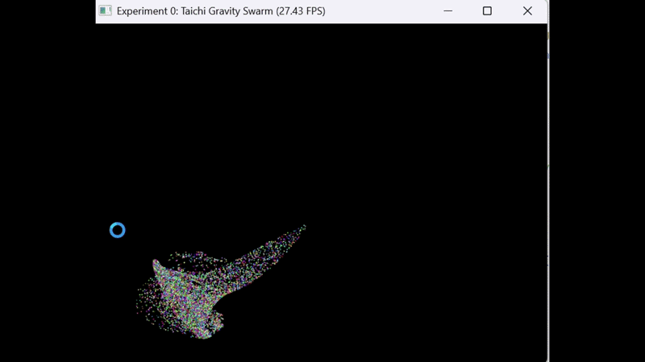

# README\(实验1）

# CG 实验室\-第一次作业

北师大人工智能学院计算机图形学课程实验代码——粒子动画系统

**于理想 202411040016**

完成了必做与选做

## 项目简介

这是一个基于 Taichi 框架实现的粒子物理模拟系统，通过 GPU 并行计算实现了高效的粒子动画效果。粒子会受到鼠标引力作用，在窗口内自由运动并与边界发生碰撞反弹。

## 效果展示



## 环境要求

- Python 3\.9 或更高版本

- GPU 支持（推荐）或 CPU

- Windows / Linux / macOS

## 安装步骤

### 1\. 克隆仓库

```Bash
git clone https://github.com/Yideal/CG-Lab.git
cd CG-Lab
```

### 2\. 安装依赖

使用 pip 安装 Taichi：

```Bash
pip install taichi
```

或者使用项目配置文件安装：

```Bash
pip install -e .
```

## 运行项目

### 方式一：直接运行

```Bash
python -m src.Work0.main
```

### 方式二：运行主文件

```Bash
python src/Work0/main.py
```

运行后会弹出一个窗口，移动鼠标即可看到粒子被吸引的效果。

## 项目结构

```Plaintext
CG-Lab/
├── src/
│   └── Work0/
│       ├── __init__.py      # 包初始化文件
│       ├── config.py        # 可配置参数
│       ├── main.py          # 主程序入口
│       ├── physics.py       # 物理计算核心
│       └── test.py          # 测试文件
├── .gitignore               # Git 忽略文件配置
├── .python-version          # Python 版本锁定
├── README.md                # 项目说明文档
├── main.py                  # 项目根入口
├── pyproject.toml           # 项目配置文件
└── uv.lock                  # 依赖锁定文件
```

## 参数配置

所有可调参数都在 `src/Work0/`[`config.py`](http://config.py) 文件中，你可以根据需要修改：

### 物理系统参数

|参数名|默认值|说明|
|---|---|---|
|`NUM_PARTICLES`|30000|粒子总数，数值越大效果越好但可能卡顿|
|`GRAVITY_STRENGTH`|0\.001|鼠标引力强度，数值越大吸引力越强|
|`DRAG_COEF`|0\.98|空气阻力系数，数值越小阻力越大|
|`BOUNCE_COEF`|\-0\.8|边界反弹能量损耗，绝对值越小反弹越弱|

### 渲染系统参数

|参数名|默认值|说明|
|---|---|---|
|`WINDOW_RES`|\(800, 600\)|窗口分辨率，格式为 \(宽度, 高度\)|
|`PARTICLE_RADIUS`|5|粒子绘制半径，数值越大粒子越大|
|粒子颜色|随机彩色|每个粒子随机生成 RGB 颜色|

### 调整建议

- **性能优化**：如果运行卡顿，将 `NUM_PARTICLES` 减小到 2000\-5000

- **视觉效果**：增大 `PARTICLE_RADIUS` 可以让粒子更明显

- **物理手感**：调整 `GRAVITY_STRENGTH` 和 `DRAG_COEF` 可以改变粒子的运动特性

## 技术实现

### 核心技术

- **Taichi 框架**：高性能并行计算框架，自动将 Python 代码编译为 GPU 代码

- **GPU 并行计算**：所有粒子的物理计算都在 GPU 上并行执行，性能远超 CPU

- **实时渲染**：基于 Taichi GUI 实现实时粒子渲染

### 实现原理

1. **数据结构**：使用 Taichi 的 `field` 在显存中存储粒子位置、速度和颜色

2. **物理计算**：每个粒子独立计算受到的引力、阻力和边界碰撞

3. **渲染循环**：每一帧更新所有粒子位置并绘制到屏幕

### 关键代码说明

#### 粒子初始化

```Python
@ti.kernel
def init_particles():
    for i in range(NUM_PARTICLES):
        pos[i] = [ti.random(), ti.random()]  # 随机位置
        vel[i] = [0.0, 0.0]                   # 初始速度为 0
        color[i] = generate_random_color()    # 随机颜色
```

#### 物理更新

```Python
@ti.kernel
def update_particles(mouse_x: float, mouse_y: float):
    for i in range(NUM_PARTICLES):
        # 计算鼠标引力
        dir = mouse_pos - pos[i]
        dist = dir.norm()
        if dist > 0.05:
            vel[i] += dir.normalized() * GRAVITY_STRENGTH
        
        # 应用阻力和位置更新
        vel[i] *= DRAG_COEF
        pos[i] += vel[i]
        
        # 边界碰撞检测
        # ... 碰撞处理代码
```

## 常见问题

### 运行时提示缺少 taichi 模块

**解决方案**：安装 taichi 库

```Bash
pip install taichi
```

### 程序运行很卡

**解决方案**：减小粒子数量，在 [`config.py`](http://config.py) 中修改：

```Python
NUM_PARTICLES = 2000  # 从 30000 减小到 2000
```

### GPU 初始化失败

**解决方案**：Taichi 会自动回退到 CPU 模式，虽然性能稍差但仍可正常运行。

### 窗口无法显示

**解决方案**：确保系统支持图形界面，Linux 用户可能需要安装 X11 相关依赖。

## 后续优化方向

* [ ] 添加更多粒子形状（方形、三角形等）

* [ ] 实现粒子间碰撞检测

* [ ] 添加粒子发射器效果

* [ ] 支持多种物理力场（斥力、涡流等）

* [ ] 添加用户交互界面（参数调节面板）

## 课程信息

- **课程名称**：计算机图形学

- **所属学院**：北京师范大学人工智能学院

- **实验内容**：粒子动画系统

- **实验作者**：于理想

- **开发工具**：Taichi \+ Python

## 许可证

本项目仅用于课程学习和交流。

## 联系方式

如有问题或建议，欢迎通过 [1816571030@qq\.com](mailto:1816571030@qq.com) 联系。

---

**最后更新时间**：2026\-03\-05

