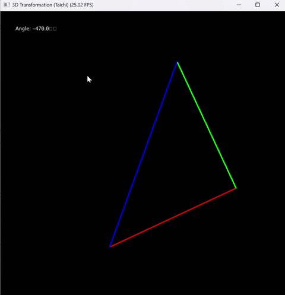
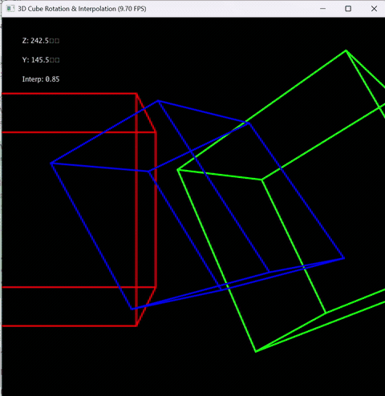

# README（实验2）

# CG 实验室 \- 实验二

北师大人工智能学院计算机图形学课程实验2——旋转与变换

**于理想 202411040016**

完成了必做与选做

## 项目简介

本项目实现了基于 Taichi 框架的 3D 坐标变换系统，通过 MVP（Model\-View\-Projection）矩阵变换将三维空间中的几何体投影到二维屏幕。实验包含基础版本（三角形旋转）和选做内容（3D立方体与旋转插值）。

## 效果展示

### 基础版本：三角形旋转

【三角旋转图片】



### 选做内容：3D 立方体与旋转插值

【拓展内容图片】



## 环境要求

- Python 3\.12 或更高版本

- Taichi 1\.7\.4 或更高版本

- Windows / Linux / macOS

## 安装步骤

### 1\. 克隆仓库

```Bash
git clone https://github.com/Yideal/CG-Lab.git
cd CG-Lab
```

### 2\. 激活虚拟环境

```Bash
# 使用 uv（推荐）
uv sync

# 或使用 conda
conda activate cg_env
```

## 运行项目

### 基础版本：三角形旋转

```Bash
# 使用 uv
uv run -m src.Work2.main

# 或直接使用虚拟环境中的 Python
.\.venv\Scripts\python.exe -m src.Work2.main
```

**操作说明：**

- `A` 键：逆时针旋转

- `D` 键：顺时针旋转

- `Esc` 键：退出程序

### 选做内容：3D 立方体与旋转插值

```Bash
# 使用 uv
uv run -m src.Work2.main_cube

# 或直接使用虚拟环境中的 Python
.\.venv\Scripts\python.exe -m src.Work2.main_cube
```

**操作说明：**

- `A`/`D` 键：控制绕 Z 轴旋转角度

- `W`/`S` 键：控制绕 Y 轴旋转角度

- `Esc` 键：退出程序

**显示说明：**

- 红色立方体：起始状态（不旋转）

- 绿色立方体：结束状态（自动旋转）

- 蓝色立方体：插值过渡状态（在起始和结束之间平滑过渡）

## 项目结构

```Plaintext
CG-Lab/
├── src/
│   ├── Work1/              # 实验一：粒子动画系统
│   │   ├── __init__.py
│   │   ├── config.py
│   │   ├── main.py
│   │   └── physics.py
│   └── Work2/              # 实验二：旋转与变换
│       ├── __init__.py
│       ├── main.py         # 基础版本：三角形旋转
│       └── main_cube.py    # 选做内容：3D 立方体与旋转插值
├── .gitignore
├── .python-version
├── README.md
├── pyproject.toml
└── uv.lock
```

## 技术实现

### 核心概念

#### MVP 变换流程

1. **模型变换（Model）**：将物体从局部坐标系变换到世界坐标系

2. **视图变换（View）**：将世界坐标系变换到相机坐标系

3. **投影变换（Projection）**：将相机坐标系变换到裁剪空间

#### 变换矩阵

**模型变换矩阵（绕 Z 轴旋转）：**

$M\_{model} = \begin{bmatrix}\cos\theta & -\sin\theta & 0 & 0 \\\sin\theta & \cos\theta & 0 & 0 \\0 & 0 & 1 & 0 \\0 & 0 & 0 & 1\end{bmatrix}$

**视图变换矩阵（相机平移）：**

$M\_{view} = \begin{bmatrix}1 & 0 & 0 & -eye\_x \\0 & 1 & 0 & -eye\_y \\0 & 0 & 1 & -eye\_z \\0 & 0 & 0 & 1\end{bmatrix}$

**透视投影矩阵：**

透视投影分为两步：

1. **挤压矩阵**：将透视平截头体挤压为长方体

2. **正交投影矩阵**：将长方体缩放平移到标准设备坐标系

$M\_{proj} = M\_{ortho} \times M\_{persp \to ortho}$

### 关键代码说明

#### 模型变换矩阵

```Python
@ti.func
def get_model_matrix(angle: ti.f32):
    """绕 Z 轴旋转矩阵"""
    rad = angle * math.pi / 180.0
    c = ti.cos(rad)
    s = ti.sin(rad)
    return ti.Matrix([
        [c, -s, 0.0, 0.0],
        [s,  c, 0.0, 0.0],
        [0.0, 0.0, 1.0, 0.0],
        [0.0, 0.0, 0.0, 1.0]
    ])
```

#### 透视投影矩阵

```Python
@ti.func
def get_projection_matrix(eye_fov: ti.f32, aspect_ratio: ti.f32, zNear: ti.f32, zFar: ti.f32):
    """透视投影矩阵"""
    n = -zNear  # 近截面（相机看向 -Z 方向）
    f = -zFar   # 远截面
    
    fov_rad = eye_fov * math.pi / 180.0
    t = ti.tan(fov_rad / 2.0) * ti.abs(n)  # 上边界
    b = -t        # 下边界
    r = aspect_ratio * t  # 右边界
    l = -r        # 左边界
    
    # 挤压矩阵
    M_p2o = ti.Matrix([
        [n, 0.0, 0.0, 0.0],
        [0.0, n, 0.0, 0.0],
        [0.0, 0.0, n + f, -n * f],
        [0.0, 0.0, 1.0, 0.0]
    ])
    
    # 正交投影矩阵
    M_ortho_scale = ti.Matrix([
        [2.0 / (r - l), 0.0, 0.0, 0.0],
        [0.0, 2.0 / (t - b), 0.0, 0.0],
        [0.0, 0.0, 2.0 / (n - f), 0.0],
        [0.0, 0.0, 0.0, 1.0]
    ])
    
    M_ortho_trans = ti.Matrix([
        [1.0, 0.0, 0.0, -(r + l) / 2.0],
        [0.0, 1.0, 0.0, -(t + b) / 2.0],
        [0.0, 0.0, 1.0, -(n + f) / 2.0],
        [0.0, 0.0, 0.0, 1.0]
    ])
    
    return M_ortho_scale @ M_ortho_trans @ M_p2o
```

#### MVP 变换与透视除法

```Python
@ti.kernel
def compute_transform(angle: ti.f32):
    """计算顶点的坐标变换"""
    eye_pos = ti.Vector([0.0, 0.0, 5.0])
    model = get_model_matrix(angle)
    view = get_view_matrix(eye_pos)
    proj = get_projection_matrix(45.0, 1.0, 0.1, 50.0)
    
    # MVP 矩阵：右乘原则
    mvp = proj @ view @ model
    
    for i in range(3):
        v = vertices[i]
        v4 = ti.Vector([v[0], v[1], v[2], 1.0])  # 补全齐次坐标
        v_clip = mvp @ v4                         # 裁剪空间坐标
        
        # 透视除法：转化为 NDC 坐标 [-1, 1]
        v_ndc = v_clip / v_clip[3]
        
        # 视口变换：映射到 GUI 的 [0, 1] x [0, 1] 空间
        screen_coords[i][0] = (v_ndc[0] + 1.0) / 2.0
        screen_coords[i][1] = (v_ndc[1] + 1.0) / 2.0
```

### 选做内容实现

#### 旋转插值

通过线性插值实现两个旋转状态之间的平滑过渡：

```Python
@ti.kernel
def compute_transform_interp(angle_z: ti.f32, angle_y: ti.f32, t: ti.f32):
    """计算插值立方体的变换"""
    # 起始状态
    model_start = get_model_matrix_y(0.0) @ get_model_matrix_z(0.0)
    
    # 结束状态
    model_end = get_model_matrix_y(angle_y) @ get_model_matrix_z(angle_z)
    
    # 矩阵插值（线性插值）
    model = ti.Matrix.zero(ti.f32, 4, 4)
    for i in ti.static(range(4)):
        for j in ti.static(range(4)):
            model[i, j] = model_start[i, j] * (1.0 - t) + model_end[i, j] * t
```

#### 3D 立方体定义

```Python
# 立方体 8 个顶点（中心在原点，边长为 2）
vertices[0] = [-1.0, -1.0, -1.0]
vertices[1] = [1.0, -1.0, -1.0]
vertices[2] = [1.0, 1.0, -1.0]
vertices[3] = [-1.0, 1.0, -1.0]
vertices[4] = [-1.0, -1.0, 1.0]
vertices[5] = [1.0, -1.0, 1.0]
vertices[6] = [1.0, 1.0, 1.0]
vertices[7] = [-1.0, 1.0, 1.0]

# 立方体 12 条边
edges = [
    (0, 1), (1, 2), (2, 3), (3, 0),  # 前面
    (4, 5), (5, 6), (6, 7), (7, 4),  # 后面
    (0, 4), (1, 5), (2, 6), (3, 7)   # 连接前后
]
```

## 实验要点

### 角度与弧度转换

Python 中的三角函数使用弧度制，需要将角度转换为弧度：

```Python
rad = angle * math.pi / 180.0
```

### Z 轴符号

相机看向 \-Z 方向，因此近截面和远截面的实际坐标为负值：

```Python
n = -zNear  # 近截面坐标
f = -zFar   # 远截面坐标
```

### 矩阵乘法顺序

使用列向量时，矩阵乘法遵循右乘原则：

```Python
mvp = proj @ view @ model  # 从右向左执行
```

### 透视除法

经过 MVP 变换后，顶点为齐次坐标 $(x, y, z, w)$，需要除以 $w$ 归一化：

```Python
v_ndc = v_clip / v_clip[3]
```

## 常见问题

### 三角形不旋转

**可能原因：**

1. 窗口没有获得焦点

2. 输入法不是英文模式

**解决方案：**

- 点击窗口确保获得焦点

- 切换到英文输入法再按键

### 立方体显示不正常

**可能原因：**

1. 顶点坐标定义错误

2. 边的索引对不正确

**解决方案：**

- 检查顶点坐标是否在 \[\-1, 1\] 范围内

- 验证边的索引对是否正确连接顶点

### 插值动画不平滑

**可能原因：**

1. 矩阵插值方法不正确

2. 插值参数变化太快

**解决方案：**

- 使用四元数插值（SLERP）代替线性插值

- 减小插值参数的变化步长

### GPU 初始化失败

**解决方案：**

- Taichi 会自动回退到 CPU 模式，虽然性能稍差但仍可正常运行

- 检查显卡驱动是否正确安装

## 后续优化方向

* [ ] 实现四元数旋转插值（SLERP）

* [ ] 添加更多几何体（球体、圆柱等）

* [ ] 实现光照和材质效果

* [ ] 添加纹理映射

* [ ] 支持用户自定义变换矩阵

* [ ] 实现相机漫游功能

## 课程信息

- **课程名称**：计算机图形学

- **所属学院**：北京师范大学人工智能学院

- **实验内容**：旋转与变换

- **实验作者**：于理想

- **开发工具**：Taichi \+ Python

## 许可证

本项目仅用于课程学习和交流。

## 联系方式

如有问题或建议，欢迎通过 [1816571030@qq\.com](mailto:1816571030@qq.com) 联系。

---

**最后更新时间**：2026\-06\-25

