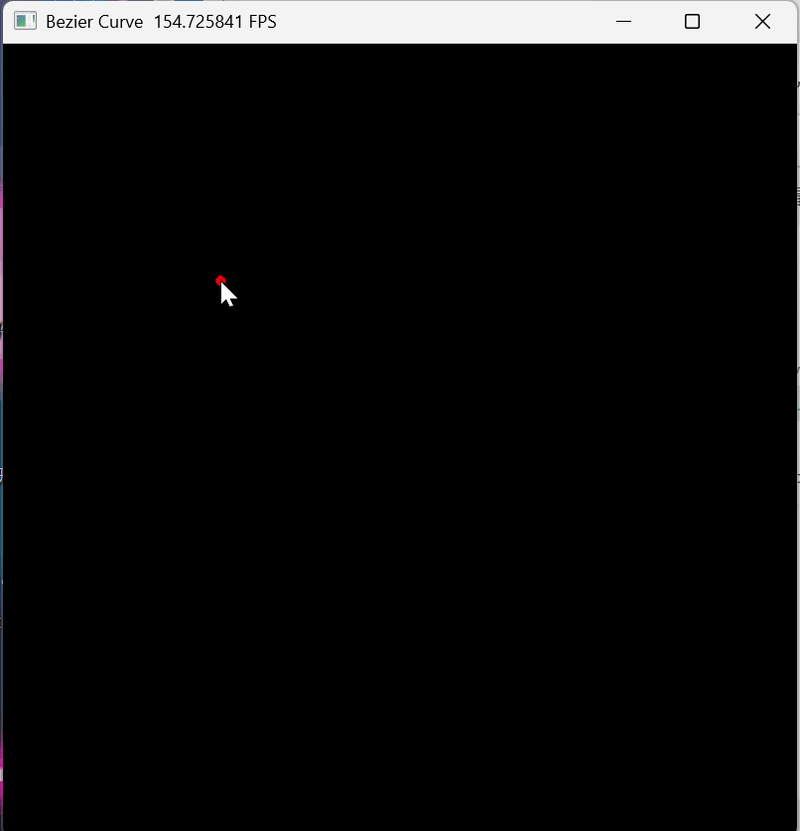
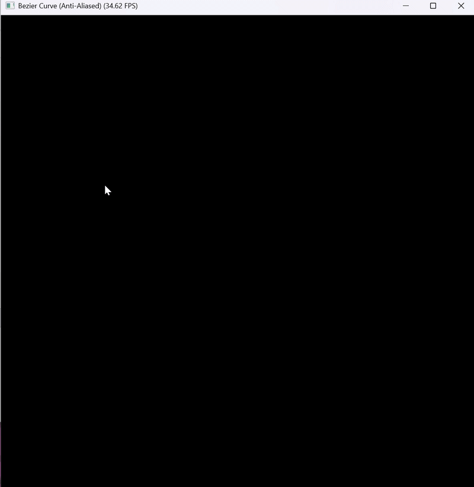
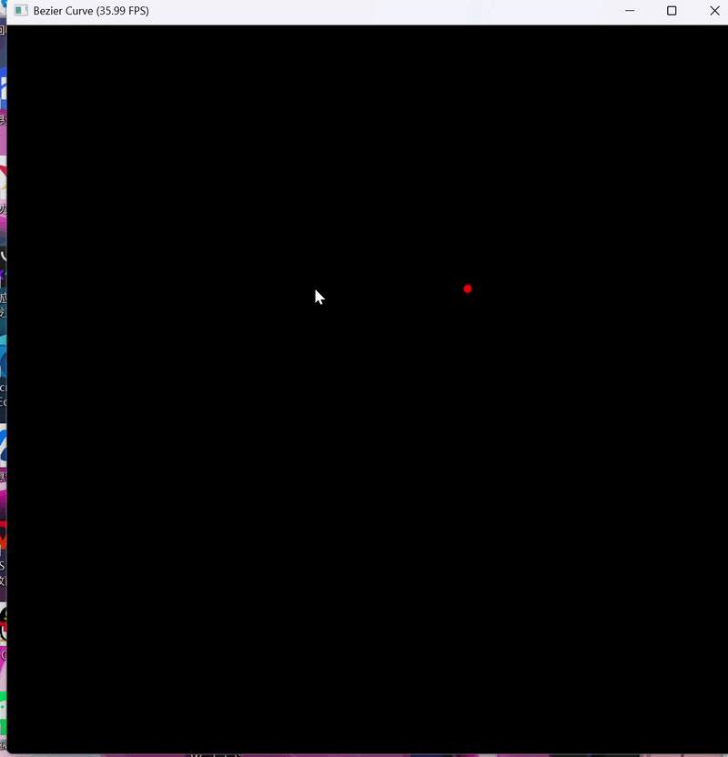

# README（实验3）

# CG 实验室 \- 实验三

北师大人工智能学院计算机图形学课程实验3——贝塞尔曲线

**于理想 202411040016**

完成了必做与选做

## 项目简介

本项目实现了基于 Taichi 框架的交互式贝塞尔曲线绘制系统。通过 De Casteljau 递归算法计算曲线上的点，并利用 GPU 并行计算实现高效的像素光栅化。实验包含基础版本（贝塞尔曲线）和选做内容（反走样贝塞尔曲线、B样条曲线）。

## 效果展示

### 基础版本：贝塞尔曲线

【贝塞尔曲线基础版本效果】



### 选做内容1：反走样贝塞尔曲线

【反走样贝塞尔曲线效果】



### 选做内容2：B样条曲线

【B样条曲线效果】



## 环境要求

- Python 3\.9 或更高版本

- Taichi 1\.7\.3 或更高版本

- Windows / Linux / macOS

- GPU 支持（推荐）或 CPU

## 安装步骤

### 1\. 克隆仓库

```Bash
git clone https://github.com/Yideal/CG-Lab.git
cd CG-Lab
```

### 2\. 激活虚拟环境

```Bash
# 使用 uv（推荐）
uv sync

# 或使用 conda
conda activate cg_env
```

## 运行项目

### 基础版本：贝塞尔曲线

```Bash
# 使用 uv
uv run -m src.Work3.main

# 或直接使用虚拟环境中的 Python
python -m src.Work3.main
```

**操作说明：**

- 鼠标左键点击：添加控制点（红色圆点）

- `c` 键：清空所有控制点

- `Esc` 键：退出程序

### 选做内容1：反走样贝塞尔曲线

```Bash
python -m src.Work3.main_antialias
```

**操作说明：**

- 鼠标左键点击：添加控制点

- `c` 键：清空所有控制点

- `Esc` 键：退出程序

### 选做内容2：B样条曲线

```Bash
python -m src.Work3.main_bspline
```

**操作说明：**

- 鼠标左键点击：添加控制点

- `c` 键：清空所有控制点

- `b` 键：切换贝塞尔曲线（绿色）/ B样条曲线（蓝色）模式

- `Esc` 键：退出程序

**显示说明：**

- 红色圆点：控制点

- 灰色线条：控制多边形（连接相邻控制点）

- 绿色曲线：贝塞尔曲线（全局控制特性）

- 蓝色曲线：B样条曲线（局部控制特性）

## 项目结构

```Plaintext
CG-Lab/
├── src/
│   ├── Work1/              # 实验一：粒子动画系统
│   ├── Work2/              # 实验二：旋转与变换
│   └── Work3/              # 实验三：贝塞尔曲线
│       ├── __init__.py
│       ├── main.py         # 基础版本：贝塞尔曲线
│       ├── main_antialias.py    # 选做1：反走样贝塞尔曲线
│       └── main_bspline.py      # 选做2：B样条曲线
├── .gitignore
├── .python-version
├── pyproject.toml
└── uv.lock
```

## 参数配置

所有可调参数都在各主文件的开头定义：

### 通用参数

|参数名|默认值|说明|
|---|---|---|
|`WIDTH`|800|窗口宽度（像素）|
|`HEIGHT`|800|窗口高度（像素）|
|`MAX_CONTROL_POINTS`|100|最大控制点数量|
|`NUM_SEGMENTS`|1000|曲线采样点数量|

### 反走样参数（main\_antialias\.py）

|参数名|默认值|说明|
|---|---|---|
|`PIXEL_RADIUS`|1\.5|反走样半径，越大边缘越平滑|

### 调整建议

- **性能优化**：如果运行卡顿，将 `NUM_SEGMENTS` 减小到 500\-1000

- **反走样效果**：增大 `PIXEL_RADIUS` 可以让曲线边缘更平滑，但会增加计算量

- **曲线精度**：增大 `NUM_SEGMENTS` 可以提高曲线精度，但会增加内存占用

## 技术实现

### 核心概念

#### De Casteljau 算法

贝塞尔曲线由一组控制点决定，参数 $t \in [0, 1]$ 从0连续变化到1时，曲线上的所有点构成完整的曲线。

De Casteljau 算法通过递归线性插值计算曲线上的点：

1. **第一层插值**：对于给定的 $t$，将相邻两个点连线，并在连线上找到比例为 $t$ 的点

2. **递归**：对新生成的点重复上述线性插值操作

3. **终止**：当最终只插值出一个点时，该点即为贝塞尔曲线在参数 $t$ 处的位置

#### 光栅化基础

屏幕本质上是一个巨大的二维像素网格。在本实验中，需要手动"点亮"对应的像素：

1. 创建一个尺寸为 `800 x 800` 的二维数组（Taichi Field），存储每个像素的 RGB 颜色值

2. 使用 De Casteljau 算法计算出的点坐标是 `[0, 1]` 范围内的归一化浮点数

3. 将浮点坐标乘以屏幕的长宽，并强制转换为整数，找到对应的物理像素索引

4. 将该索引处的颜色修改为绿色，即"点亮像素"

#### CPU\-GPU 通信优化

在现代图形学编程中，CPU 和 GPU 是物理分离的，它们之间通过 PCIe 总线通信。如果在 Python（CPU）的 `for` 循环里，每次算出一点就去修改 Taichi 的 GPU Field，海量的跨界通信将使帧率大幅降低。

**正确的做法（Batching）**：

1. 在 CPU 里把所有点的坐标全算好，装进一个 numpy 数组

2. 使用 `curve_points_field.from_numpy()` 一次性发送给 GPU

3. 让 GPU 并行地把所有像素点亮

### 关键代码说明

#### De Casteljau 算法实现

```Python
def de_casteljau(points, t):
    """纯 Python 递归实现 De Casteljau 算法"""
    if len(points) == 1:
        return points[0]
    next_points = []
    for i in range(len(points) - 1):
        p0 = points[i]
        p1 = points[i + 1]
        x = (1.0 - t) * p0[0] + t * p1[0]
        y = (1.0 - t) * p0[1] + t * p1[1]
        next_points.append([x, y])
    return de_casteljau(next_points, t)
```

**算法流程：**

- 输入：控制点列表 `points` 和参数 `t`

- 递归终止条件：当只剩下一个点时，直接返回该点

- 递归步骤：对相邻点进行线性插值，生成新的控制点列表，然后递归调用

#### GPU 绘制内核

```Python
@ti.kernel
def draw_curve_kernel(n: ti.i32):
    """GPU 并行绘制曲线"""
    for i in range(n):
        pt = curve_points_field[i]
        x_pixel = ti.cast(pt[0] * WIDTH, ti.i32)
        y_pixel = ti.cast(pt[1] * HEIGHT, ti.i32)
        if 0 <= x_pixel < WIDTH and 0 <= y_pixel < HEIGHT:
            pixels[x_pixel, y_pixel] = ti.Vector([0.0, 1.0, 0.0])
```

**关键技术点：**

- `@ti.kernel` 装饰器：将 Python 函数编译为 GPU 内核

- 被装饰的 `for` 循环会在 GPU 上并行执行

- 越界检查：确保 `x_pixel` 和 `y_pixel` 在有效范围内

### 选做内容实现

#### 选做1：反走样贝塞尔曲线

基础的光栅化绘制中，由于坐标截断（强转为 `int`）仅点亮单一像素，会导致曲线呈现明显的阶梯状边缘，即走样现象。

**反走样算法实现：**

```Python
@ti.kernel
def draw_curve_antialiased(n: ti.i32):
    """GPU 反走样绘制：基于距离的颜色衰减"""
    for i in range(n):
        pt = curve_points_field[i]
        x_center = pt[0] * WIDTH
        y_center = pt[1] * HEIGHT
        
        for dx in ti.static(range(-1, 2)):
            for dy in ti.static(range(-1, 2)):
                pixel_x = int(x_center) + dx
                pixel_y = int(y_center) + dy
                
                if 0 <= pixel_x < WIDTH and 0 <= pixel_y < HEIGHT:
                    center_x = float(pixel_x) + 0.5
                    center_y = float(pixel_y) + 0.5
                    dist = ti.sqrt((center_x - x_center) ** 2 + (center_y - y_center) ** 2)
                    
                    if dist < PIXEL_RADIUS:
                        weight = 1.0 - (dist / PIXEL_RADIUS)
                        weight = weight * weight
                        pixels[pixel_x, pixel_y] = ti.Vector([0.0, weight, 0.0])
```

**算法原理：**

- 利用亚像素级精度：数学插值生成的浮点坐标具备亚像素级精度

- 考察曲线点周围的 3x3 像素邻域

- 计算各像素中心点与精确浮点坐标之间的空间距离

- 基于距离衰减模型，为邻域内的多个像素分配不同的颜色权重

#### 选做2：B样条曲线

贝塞尔曲线存在两个局限性：

1. **全局控制特性**：移动或添加任意一个控制点，整条曲线的形状都会发生改变

2. **阶数绑定**：n 个控制点对应 n\-1 阶多项式，控制点较多时计算复杂度急剧上升

B样条曲线通过引入节点向量和分段多项式基函数，实现了"局部控制"。

**Cox\-de Boor 递归公式：**

```Python
def cox_de_boor(i, k, u, knot_vector):
    """Cox-de Boor 递归公式计算 B 样条基函数"""
    if k == 1:
        if knot_vector[i] <= u < knot_vector[i + 1]:
            return 1.0
        else:
            return 0.0
    else:
        denom1 = knot_vector[i + k - 1] - knot_vector[i]
        denom2 = knot_vector[i + k] - knot_vector[i + 1]
        if denom1 == 0: denom1 = 1.0
        if denom2 == 0: denom2 = 1.0
        
        result = 0.0
        if denom1 != 0:
            result += ((u - knot_vector[i]) / denom1) * cox_de_boor(i, k - 1, u, knot_vector)
        if denom2 != 0:
            result += ((knot_vector[i + k] - u) / denom2) * cox_de_boor(i + 1, k - 1, u, knot_vector)
        return result
```

**贝塞尔与 B样条对比：**

|特性|贝塞尔曲线|B样条曲线|
|---|---|---|
|控制点影响|全局控制（修改一点影响整条曲线）|局部控制（修改一点仅影响局部）|
|曲线阶数|n\-1 阶（n 个控制点）|固定阶数（不受控制点数量影响）|
|通过端点|一定通过第一个和最后一个控制点|不一定通过端点|
|计算复杂度|O\(n\) 每次评估|O\(k\) 每次评估（k 为阶数）|

## 实验要点

### 递归深度控制

De Casteljau 算法的递归深度等于控制点数量减一。当控制点数量较大时，递归深度也会增加，可能导致栈溢出。本实验中设置了最大控制点数量为 100。

### GPU 缓冲区预分配

现代高性能渲染管线极其反感在主循环中"动态申请内存"。本实验预先分配了固定大小的 GPU 缓冲区：

- `pixels`：800 x 800 的像素缓冲区

- `curve_points_field`：用于接收曲线坐标

- `gui_points`：用于存放控制点（对象池）

### 控制点绘制技巧

由于 `canvas.circles()` 只能接收定长的 Taichi Field，当有少量控制点时，需要将其填充到固定大小的数组中：

```Python
np_points = np.full((MAX_CONTROL_POINTS, 2), -10.0, dtype=np.float32)
np_points[:current_count] = np.array(control_points, dtype=np.float32)
gui_points.from_numpy(np_points)
```

填充值 `-10.0` 位于屏幕可见区域之外，因此不会被显示。

## 常见问题

### 运行时提示缺少 taichi 模块

**解决方案**：安装 taichi 库

```Bash
pip install taichi
```

### 程序运行很卡

**可能原因：**

1. 采样点数量过多

2. GPU 内存带宽不足

**解决方案：**

- 减小 `NUM_SEGMENTS` 参数

- 使用 CPU 模式运行（修改 `ti.init(arch=ti.cpu)`）

### 曲线显示不完整或有缺口

**可能原因：**

1. 采样点数量不足

2. 反走样半径过大

**解决方案：**

- 增大 `NUM_SEGMENTS` 参数

- 减小 `PIXEL_RADIUS` 参数（仅反走样版本）

### B样条曲线不显示

**可能原因：**

- 控制点数量不足（B样条至少需要 4 个控制点）

**解决方案：**

- 添加至少 4 个控制点后再切换到 B样条模式

### GPU 初始化失败

**解决方案：**

- Taichi 会自动回退到 CPU 模式，虽然性能稍差但仍可正常运行

- 检查显卡驱动是否正确安装

## 后续优化方向

* [ ] 实现迭代版本的 De Casteljau 算法（避免递归深度限制）

* [ ] 添加曲线颜色自定义功能

* [ ] 实现曲线拖拽编辑（点击并移动控制点）

* [ ] 添加曲线保存/加载功能

* [ ] 实现更高阶的反走样算法（如超采样）

* [ ] 添加曲线长度计算功能

## 课程信息

- **课程名称**：计算机图形学

- **所属学院**：北京师范大学人工智能学院

- **实验内容**：贝塞尔曲线

- **实验作者**：于理想

- **开发工具**：Taichi \+ Python

## 许可证

本项目仅用于课程学习和交流。

## 联系方式

如有问题或建议，欢迎通过 [1816571030@qq\.com](mailto:1816571030@qq.com) 联系。

---

**最后更新时间**：2026\-06\-30

