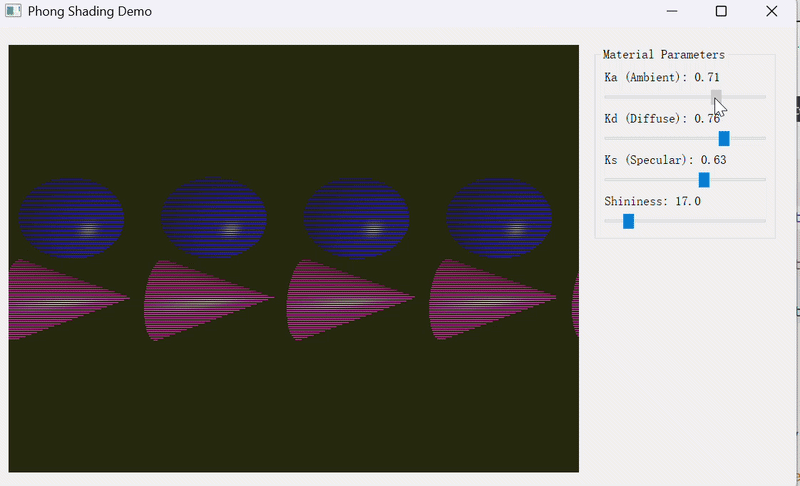
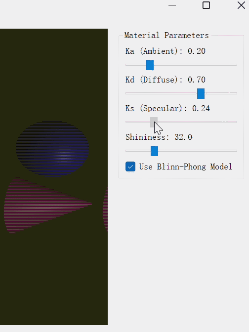
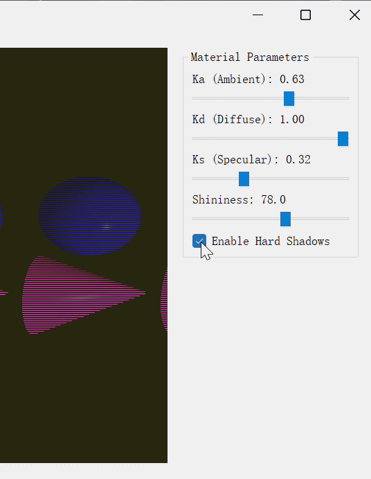

# README（实验4）

# CG 实验室 - 实验四

北师大人工智能学院计算机图形学课程实验4——Phong 光照模型

**于理想 202411040016 人工智能专业**

完成了必做与选做

## 项目简介

本项目实现了基于 Taichi 框架的交互式 Phong 光照渲染系统。通过光线投射（Ray Casting）技术实现了红色球体和紫色圆锥的三维场景渲染，并利用 Phong 光照模型计算环境光、漫反射和镜面高光。实验包含基础版本（Phong 光照模型）和选做内容（Blinn-Phong 模型升级、硬阴影）。

## 效果展示

### 基础版本：Phong 光照模型

【Phong光照模型基础版本效果】



### 选做内容1：Blinn-Phong 模型升级

【Blinn-Phong模型效果】



### 选做内容2：硬阴影

【硬阴影效果】



## 环境要求

- Python 3.9 或更高版本

- Taichi 1.7.3 或更高版本

- PyQt5（用于 UI 交互面板）

- Windows / Linux / macOS

- GPU 支持（推荐）或 CPU

## 安装步骤

### 1. 克隆仓库

```bash
git clone https://github.com/Yideal/CG-Lab.git
cd CG-Lab
```

### 2. 激活虚拟环境

```bash
# 使用 uv（推荐）
uv sync

# 或使用 conda
conda activate cg_env
```

### 3. 安装 PyQt5（选做）

```bash
pip install pyqt5
```

## 运行项目

### 基础版本：Phong 光照模型

```bash
python -m src.Work4.main
```

**操作说明：**

- 拖动右侧滑块调节材质参数：

    - Ka：环境光系数（0.0 ~ 1.0）

    - Kd：漫反射系数（0.0 ~ 1.0）

    - Ks：镜面高光系数（0.0 ~ 1.0）

    - Shininess：高光指数（1.0 ~ 128.0）

- 关闭窗口退出程序

### 选做内容1：Blinn-Phong 模型升级

```bash
python -m src.Work4.main_blinnphong
```

**操作说明：**

- 拖动滑块调节材质参数

- 勾选/取消勾选 "Use Blinn-Phong Model" 复选框，对比 Phong 和 Blinn-Phong 的高光效果差异

### 选做内容2：硬阴影

```bash
python -m src.Work4.main_shadow
```

**操作说明：**

- 拖动滑块调节材质参数

- 勾选/取消勾选 "Enable Hard Shadows" 复选框，开启或关闭硬阴影效果

## 项目结构

```
CG-Lab/
├── src/
│   ├── Work1/              # 实验一：粒子动画系统
│   ├── Work2/              # 实验二：旋转与变换
│   ├── Work3/              # 实验三：贝塞尔曲线
│   └── Work4/              # 实验四：Phong 光照模型
│       ├── __init__.py
│       ├── main.py         # 基础版本：Phong 光照模型
│       ├── main_blinnphong.py    # 选做1：Blinn-Phong 模型升级
│       └── main_shadow.py        # 选做2：硬阴影
├── .gitignore
├── .python-version
├── pyproject.toml
└── uv.lock
```

## 参数配置

所有可调参数都在各主文件的开头定义：

### 通用参数

| 参数名 | 默认值 | 说明 |
|--------|--------|------|
| `res_x` | 800 | 窗口宽度（像素） |
| `res_y` | 600 | 窗口高度（像素） |
| `Ka` | 0.2 | 环境光系数 |
| `Kd` | 0.7 | 漫反射系数 |
| `Ks` | 0.5 | 镜面高光系数 |
| `shininess` | 32.0 | 高光指数 |

### 几何体参数

| 参数名 | 默认值 | 说明 |
|--------|--------|------|
| 球体位置 | (-1.2, -0.2, 0.0) | 红色球体中心坐标 |
| 球体半径 | 1.2 | 红色球体半径 |
| 圆锥顶点 | (1.2, 1.2, 0.0) | 紫色圆锥顶点坐标 |
| 圆锥底面 y | -1.4 | 紫色圆锥底面高度 |
| 圆锥底面半径 | 1.2 | 紫色圆锥底面半径 |

### 光源与摄像机参数

| 参数名 | 默认值 | 说明 |
|--------|--------|------|
| 摄像机位置 | (0, 0, 5) | 光线起点位置 |
| 光源位置 | (2, 3, 4) | 点光源位置 |
| 光源颜色 | (1.0, 1.0, 1.0) | 白色光源 |
| 背景颜色 | (0.05, 0.15, 0.15) | 深青色背景 |

## 技术实现

### 核心概念

#### Phong 光照模型

Phong 光照模型是一种经典的计算机图形学经验模型，它将物体表面反射的光分为三个独立的计算分量：

$$I = I_{ambient} + I_{diffuse} + I_{specular}$$

**环境光 (Ambient)**：模拟场景中经过多次反射后均匀分布的背景光。

$$I_{ambient} = K_a \times C_{light} \times C_{object}$$

**漫反射 (Diffuse)**：模拟粗糙表面向各个方向均匀散射的光，强度与光线入射角的余弦值成正比（Lambert 定律）。

$$I_{diffuse} = K_d \times \max(0, \mathbf{N} \cdot \mathbf{L}) \times C_{light} \times C_{object}$$

**镜面高光 (Specular)**：模拟光滑表面反射的强光，强度与观察方向和理想反射方向的夹角有关。

$$I_{specular} = K_s \times \max(0, \mathbf{R} \cdot \mathbf{V})^n \times C_{light}$$

其中：
- $$\mathbf{N}$$ 为表面法向量
- $$\mathbf{L}$$ 为指向光源的方向向量
- $$\mathbf{V}$$ 为指向摄像机的方向向量
- $$\mathbf{R}$$ 为光线的理想反射向量
- $$n$$ 为高光指数 Shininess

#### 光线投射与求交

光线投射（Ray Casting）是一种简单的三维渲染技术，通过为每个像素发射一条射线，计算射线与场景中几何体的交点，并在交点处进行着色。

**球体求交公式**：

对于球体，光线求交问题可以转化为求解一元二次方程：

$$t^2 \cdot (\mathbf{rd} \cdot \mathbf{rd}) + 2t \cdot (\mathbf{oc} \cdot \mathbf{rd}) + (\mathbf{oc} \cdot \mathbf{oc} - r^2) = 0$$

其中：
- $$\mathbf{ro}$$ 为光线起点（摄像机位置）
- $$\mathbf{rd}$$ 为光线方向向量
- $$\mathbf{oc} = \mathbf{ro} - \mathbf{center}$$ 为起点到球心的向量
- $$r$$ 为球体半径

**圆锥求交公式**：

圆锥的数学隐式方程较为复杂，本实验采用局部坐标系变换的方法：

1. 将光线转换到以圆锥顶点为原点的局部坐标系
2. 构建一元二次方程 $$At^2 + Bt + C = 0$$，其中：
   - $$A = rd_x^2 + rd_z^2 - k \cdot rd_y^2$$
   - $$B = 2 \cdot (ro_{local_x} \cdot rd_x + ro_{local_z} \cdot rd_z - k \cdot ro_{local_y} \cdot rd_y)$$
   - $$C = ro_{local_x}^2 + ro_{local_z}^2 - k \cdot ro_{local_y}^2$$
   - $$k = (radius / height)^2$$
3. 验证交点是否在圆锥的高度范围内（局部 Y 坐标在 [-H, 0] 之间）

#### 深度测试（Z-buffer）

当射线同时击中多个物体时，必须选择距离摄像机最近的交点进行着色。本实验实现了类似 Z-buffer 的深度竞争逻辑：

1. 初始化 `min_t` 为一个很大的值（1e10）
2. 分别计算射线与球体和圆锥的交点距离 `t_sph` 和 `t_cone`
3. 如果交点距离小于当前最小距离且大于 0，则更新最小距离和对应的法向量、颜色
4. 最终只对距离摄像机最近的交点进行着色

### 关键代码说明

#### 球体求交函数

```python
@ti.func
def intersect_sphere(ro, rd, center, radius):
    t = -1.0
    normal = ti.Vector([0.0, 0.0, 0.0])
    oc = ro - center
    b = 2.0 * oc.dot(rd)
    c = oc.dot(oc) - radius * radius
    delta = b * b - 4.0 * c
    if delta > 0:
        t1 = (-b - ti.sqrt(delta)) / 2.0
        t2 = (-b + ti.sqrt(delta)) / 2.0
        if t1 > 0:
            t = t1
            p = ro + rd * t
            normal = normalize(p - center)
        elif t2 > 0:
            t = t2
            p = ro + rd * t
            normal = normalize(p - center)
    return t, normal
```

**算法流程：**
- 计算判别式 `delta`，判断是否有实数解
- 选择较小的正根作为交点距离
- 在交点处计算法向量（指向球心的方向）

#### 圆锥求交函数

```python
@ti.func
def intersect_cone(ro, rd, apex, base_y, radius):
    t = -1.0
    normal = ti.Vector([0.0, 0.0, 0.0])
    H = apex.y - base_y
    k = (radius / H) ** 2
    
    ro_local = ro - apex
    
    A = rd.x**2 + rd.z**2 - k * rd.y**2
    B = 2.0 * (ro_local.x * rd.x + ro_local.z * rd.z - k * ro_local.y * rd.y)
    C = ro_local.x**2 + ro_local.z**2 - k * ro_local.y**2
    
    if ti.abs(A) > 1e-5:
        delta = B**2 - 4.0 * A * C
        if delta > 0:
            t1 = (-B - ti.sqrt(delta)) / (2.0 * A)
            t2 = (-B + ti.sqrt(delta)) / (2.0 * A)
            
            t_first = t1
            t_second = t2
            if t1 > t2:
                t_first, t_second = t_second, t_first
                
            y1 = ro_local.y + t_first * rd.y
            if t_first > 0 and -H <= y1 <= 0:
                t = t_first
            else:
                y2 = ro_local.y + t_second * rd.y
                if t_second > 0 and -H <= y2 <= 0:
                    t = t_second
                    
            if t > 0:
                p_local = ro_local + rd * t
                normal = normalize(ti.Vector([p_local.x, -k * p_local.y, p_local.z]))
    
    return t, normal
```

**算法流程：**
- 将光线转换到圆锥局部坐标系
- 构建并求解一元二次方程
- 验证交点是否在圆锥高度范围内
- 计算圆锥表面法向量

#### 渲染内核

```python
@ti.kernel
def render():
    for i, j in pixels:
        u = (i - res_x / 2.0) / res_y * 2.0
        v = (j - res_y / 2.0) / res_y * 2.0
        
        ro = ti.Vector([0.0, 0.0, 5.0])
        rd = normalize(ti.Vector([u, v, -1.0]))
        
        min_t = 1e10
        hit_normal = ti.Vector([0.0, 0.0, 0.0])
        hit_color = ti.Vector([0.0, 0.0, 0.0])
        
        t_sph, n_sph = intersect_sphere(ro, rd, ti.Vector([-1.2, -0.2, 0.0]), 1.2)
        if 0 < t_sph < min_t:
            min_t = t_sph
            hit_normal = n_sph
            hit_color = ti.Vector([0.8, 0.1, 0.1])
            
        t_cone, n_cone = intersect_cone(ro, rd, ti.Vector([1.2, 1.2, 0.0]), -1.4, 1.2)
        if 0 < t_cone < min_t:
            min_t = t_cone
            hit_normal = n_cone
            hit_color = ti.Vector([0.6, 0.2, 0.8])
        
        color = ti.Vector([0.05, 0.15, 0.15])
        
        if min_t < 1e9:
            p = ro + rd * min_t
            N = hit_normal
            
            light_pos = ti.Vector([2.0, 3.0, 4.0])
            light_color = ti.Vector([1.0, 1.0, 1.0])
            
            L = normalize(light_pos - p)
            V = normalize(ro - p)
            
            ambient = Ka[None] * light_color * hit_color
            
            diff = ti.max(0.0, N.dot(L))
            diffuse = Kd[None] * diff * light_color * hit_color
            
            R = normalize(reflect(-L, N))
            spec = ti.max(0.0, R.dot(V)) ** shininess[None]
            specular = Ks[None] * spec * light_color
            
            color = ambient + diffuse + specular
            
        pixels[i, j] = ti.math.clamp(color, 0.0, 1.0)
```

**关键技术点：**
- 像素坐标归一化：将屏幕坐标转换为 [-1, 1] 范围内的归一化坐标
- 深度测试：选择最近的交点进行着色
- 向量归一化：所有参与点乘的向量必须是单位向量
- 颜色截断：使用 `ti.math.clamp` 将颜色限制在 [0, 1] 范围内

### 选做内容实现

#### 选做1：Blinn-Phong 模型升级

**半程向量概念**：

Blinn-Phong 模型引入了半程向量 $$\mathbf{H}$$，它是光线方向 $$\mathbf{L}$$ 和视线方向 $$\mathbf{V}$$ 的中间向量：

$$\mathbf{H} = \frac{\mathbf{L} + \mathbf{V}}{\|\mathbf{L} + \mathbf{V}\|}$$

**高光计算**：

使用半程向量替代反射向量，高光计算变为：

$$I_{specular} = K_s \times \max(0, \mathbf{N} \cdot \mathbf{H})^n \times C_{light}$$

**实现代码**：

```python
if use_blinn_phong[None]:
    H = normalize(L + V)
    spec = ti.max(0.0, N.dot(H)) ** shininess[None]
    specular = Ks[None] * spec * light_color
else:
    R = normalize(reflect(-L, N))
    spec = ti.max(0.0, R.dot(V)) ** shininess[None]
    specular = Ks[None] * spec * light_color
```

**Phong 与 Blinn-Phong 的视觉差异**：

| 特性 | Phong | Blinn-Phong |
|------|-------|-------------|
| 高光形状 | 较尖锐，边缘清晰 | 较平滑，边缘柔和 |
| 大入射角表现 | 高光可能突然消失或出现截断 | 高光渐变消失，无截断 |
| 物理含义 | 基于反射向量 | 基于半程向量（更接近微平面理论） |
| 计算复杂度 | 需要计算反射向量 | 需要计算半程向量（略快） |

**详细说明**：

在大入射角情况下（即光线几乎与表面平行），Phong 模型的反射向量 $$\mathbf{R}$$ 可能与视线方向 $$\mathbf{V}$$ 形成较大的夹角，导致 $$\mathbf{R} \cdot \mathbf{V}$$ 接近零或为负数，高光会突然消失或出现明显的截断边缘。

而 Blinn-Phong 模型使用半程向量 $$\mathbf{H}$$，即使在大入射角下，$$\mathbf{N} \cdot \mathbf{H}$$ 仍能保持一定的值，高光会渐变消失，不会出现突然的截断现象。因此，Blinn-Phong 模型的高光效果更加平滑自然，这也是为什么它在现代图形学中更为常用。

#### 选做2：硬阴影

**阴影射线原理**：

在计算光照之前，从交点向光源方向发射一条"暗影射线"(Shadow Ray)。如果这条射线在到达光源之前击中了其他几何体，则该交点处于阴影中，此时只计算环境光，漫反射和镜面高光置零。

**实现代码**：

```python
if enable_shadow[None]:
    shadow_ro = p + N * 1e-3
    shadow_rd = L
    light_dist = (light_pos - p).norm()
    
    t_sph_shadow, _ = intersect_sphere(shadow_ro, shadow_rd, ti.Vector([-1.2, -0.2, 0.0]), 1.2)
    t_cone_shadow, _ = intersect_cone(shadow_ro, shadow_rd, ti.Vector([1.2, 1.2, 0.0]), -1.4, 1.2)
    
    if (0 < t_sph_shadow < light_dist) or (0 < t_cone_shadow < light_dist):
        in_shadow = 1

if in_shadow:
    diffuse = ti.Vector([0.0, 0.0, 0.0])
    specular = ti.Vector([0.0, 0.0, 0.0])
else:
    # 正常光照计算
```

**关键技术点**：

1. **阴影射线起点偏移**：将阴影射线起点沿法线方向偏移微小距离（$$1e-3$$），避免自交问题
2. **光线距离限制**：只检测距离小于光源距离的交点，确保不会误判
3. **硬阴影特性**：阴影区域完全黑暗（只有环境光），阴影边缘清晰锐利

## 实验要点

### 向量归一化的重要性

参与点乘运算的向量（$$\mathbf{N}$$、$$\mathbf{L}$$、$$\mathbf{V}$$）必须是单位向量，否则点乘结果会包含向量长度的影响，导致光照计算错误。

### 负值截断

漫反射和高光计算中，如果 $$\mathbf{N} \cdot \mathbf{L}$$ 或 $$\mathbf{R} \cdot \mathbf{V}$$ 为负数，说明光照在物体背面。使用 `ti.max(0.0, dot_product)` 可以截断负值，避免非法运算导致的黑色噪点。

### 颜色过曝处理

最终累加出的 RGB 值可能会超过 1.0，使用 `ti.math.clamp(color, 0.0, 1.0)` 将颜色强制限制在合法区间内，避免颜色过曝发白。

### UI 交互实现

由于 `ti.ui.Window` 在当前环境下存在 Vulkan 兼容性问题，本实验使用 PyQt5 创建了独立的 GUI 界面，通过 QTimer 定期调用渲染函数实现实时更新。

## 常见问题

### 运行时提示缺少 taichi 模块

**解决方案**：安装 taichi 库
```bash
pip install taichi
```

### 运行时提示缺少 PyQt5 模块

**解决方案**：安装 PyQt5 库
```bash
pip install pyqt5
```

### 屏幕全黑

**可能原因**：
1. 向量未归一化
2. 交点计算错误
3. 法向量方向错误

**解决方案**：
- 检查所有向量是否调用了 `normalize()` 函数
- 验证球体和圆锥的求交函数逻辑
- 检查法向量计算是否正确

### 出现黑色噪点或马赛克

**可能原因**：
- $$\mathbf{N} \cdot \mathbf{L}$$ 为负数未截断
- 自交问题（阴影射线起点未偏移）

**解决方案**：
- 使用 `ti.max(0.0, dot_product)` 截断负值
- 增加阴影射线起点偏移量

### 颜色过曝发白

**解决方案**：
- 在写入像素前使用 `ti.math.clamp(color, 0.0, 1.0)`

### 阴影不显示

**可能原因**：
- 阴影射线起点偏移过大
- 光线距离计算错误

**解决方案**：
- 调整阴影射线起点偏移量
- 验证光线距离计算是否正确

### UI 窗口无法显示

**解决方案**：
- 确保系统支持图形界面
- Linux 用户可能需要安装 Qt 相关依赖

## 后续优化方向

- [ ] 实现软阴影（PCF、PCSS 等算法）
- [ ] 添加更多几何体类型（立方体、圆柱体等）
- [ ] 实现纹理映射
- [ ] 添加多光源支持
- [ ] 实现反射和折射效果
- [ ] 添加摄像机交互（旋转、平移）
- [ ] 实现光线追踪（递归反射）

## 课程信息

- **课程名称**：计算机图形学
- **所属学院**：北京师范大学人工智能学院
- **实验内容**：Phong 光照模型
- **实验作者**：于理想
- **开发工具**：Taichi + Python + PyQt5

## 许可证

本项目仅用于课程学习和交流。

## 联系方式

如有问题或建议，欢迎通过 <1816571030@qq.com> 联系。

***

**最后更新时间**：2026-06-30
