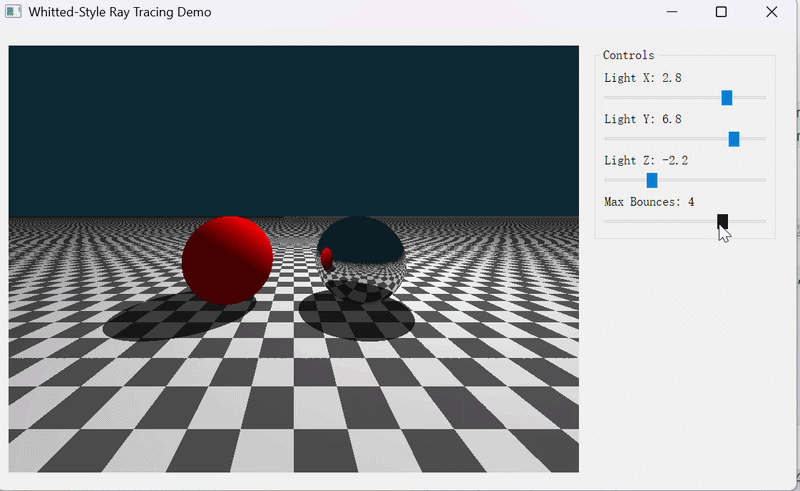
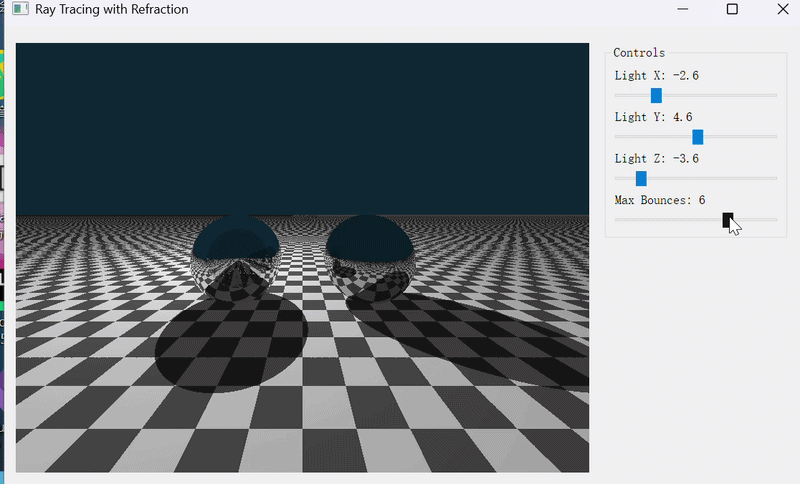

# README（实验5）

# CG 实验室 \- 实验五

北师大人工智能学院计算机图形学课程实验5——Whitted\-Style 光线追踪

**于理想 202411040016**

完成了必做与选做

## 项目简介

本项目实现了基于 Taichi 框架的交互式 Whitted\-Style 光线追踪系统。通过发射次级射线（Secondary Rays）实现了硬阴影和理想镜面反射效果，并采用迭代式循环替代递归，适配 GPU 并行计算。实验包含基础版本（光线追踪）和选做内容（折射与玻璃材质、抗锯齿）。

## 效果展示

### 必做部分：Whitted\-Style 光线追踪

【光线追踪基础版本效果】



### 选做内容1：折射与玻璃材质

【玻璃材质折射效果】



### 选做内容2：抗锯齿

【抗锯齿效果对比】


## 环境要求

- Python 3\.9 或更高版本

- Taichi 1\.7\.3 或更高版本

- PyQt5（用于 UI 交互面板）

- Windows / Linux / macOS

- GPU 支持（推荐）或 CPU

## 安装步骤

### 1\. 克隆仓库

```Bash
git clone https://github.com/Yideal/CG-Lab.git
cd CG-Lab
```

### 2\. 激活虚拟环境

```Bash
# 使用 uv（推荐）
uv sync

# 或使用 conda
conda activate cg_env
```

### 3\. 安装 PyQt5

```Bash
pip install pyqt5
```

## 运行项目

### 基础版本：Whitted\-Style 光线追踪

```Bash
python -m src.Work5.main
```

**操作说明：**

- **Light X / Light Y / Light Z**：拖动滑块动态改变点光源的三维坐标，观察阴影的实时移动

- **Max Bounces**：调整最大弹射次数（1 \~ 5），默认 3。观察弹射次数为 1 时（无反射）和弹射次数大于 1 时（出现镜中世界）的区别

- 关闭窗口退出程序

### 选做内容1：折射与玻璃材质

```Bash
python -m src.Work5.main_refraction
```

**操作说明：**

- 拖动滑块调节光源位置和最大弹射次数

- 左侧红球变为透明玻璃球，会折射后方场景

### 选做内容2：抗锯齿

```Bash
python -m src.Work5.main_antialiasing
```

**操作说明：**

- **Sample Count**：调整每个像素的采样数量（1 \~ 16）

    - 采样数为 1：无抗锯齿，边缘有明显锯齿

    - 采样数为 4：中等抗锯齿效果

    - 采样数为 16：高质量抗锯齿，边缘平滑

## 项目结构

```Plaintext
CG-Lab/
├── src/
│   ├── Work1/              # 实验一：粒子动画系统
│   ├── Work2/              # 实验二：旋转与变换
│   ├── Work3/              # 实验三：贝塞尔曲线
│   ├── Work4/              # 实验四：Phong 光照模型
│   └── Work5/              # 实验五：Whitted-Style 光线追踪
│       ├── __init__.py
│       ├── main.py         # 基础版本：光线追踪
│       ├── main_refraction.py    # 选做1：折射与玻璃材质
│       └── main_antialiasing.py  # 选做2：抗锯齿
├── .gitignore
├── .python-version
├── pyproject.toml
└── uv.lock
```

## 参数配置

所有可调参数都在各主文件的开头定义：

### 通用参数

|参数名|默认值|说明|
|---|---|---|
|`res_x`|800|窗口宽度（像素）|
|`res_y`|600|窗口高度（像素）|
|`light_pos_x`|2\.0|光源 X 坐标|
|`light_pos_y`|4\.0|光源 Y 坐标|
|`light_pos_z`|3\.0|光源 Z 坐标|
|`max_bounces`|3|最大弹射次数|

### 几何体参数

|参数名|默认值|说明|
|---|---|---|
|红色球位置|\(\-1\.5, 0\.0, 0\.0\)|左侧球体中心坐标|
|银色球位置|\(1\.5, 0\.0, 0\.0\)|右侧球体中心坐标|
|球体半径|1\.0|两个球体的半径|
|地板位置|y = \-1\.0|无限大平面的高度|
|棋盘格比例|2\.0|棋盘格纹理大小|

### 摄像机参数

|参数名|默认值|说明|
|---|---|---|
|摄像机位置|\(0\.0, 1\.0, 5\.0\)|光线起点位置|
|视角偏移|\-0\.2|向下看的角度偏移|

## 技术实现

### 核心概念

#### 光线投射与光线追踪的区别

**光线投射（Ray Casting）**：从摄像机向每个像素发射一条射线，计算射线与最近物体的交点，并在交点处进行着色。只计算直接光照，不考虑反射、折射等全局光照效果。

**光线追踪（Ray Tracing）**：在光线投射的基础上，当射线击中物体表面时，根据材质类型发射次级射线（Secondary Rays）：

- **阴影射线（Shadow Ray）**：向光源方向发射，检测是否被遮挡

- **反射射线（Reflection Ray）**：沿反射方向发射，实现镜面反射

- **折射射线（Refraction Ray）**：沿折射方向发射，实现透明材质

光线追踪能够模拟更真实的全局光照效果，但计算量更大。

#### Whitted\-Style 光线追踪模型

Whitted\-Style 光线追踪是经典的递归光线追踪算法，其核心思想如下：

1. **主光线（Primary Ray）**：从摄像机出发，穿过像素中心进入场景

2. **交点检测**：找到主光线与场景中最近物体的交点

3. **材质分支**：

    - **漫反射材质**：计算直接光照（环境光 \+ 漫反射），终止光线传播

    - **镜面反射材质**：计算反射方向，发射反射射线继续追踪

4. **光线能量衰减**：每次反射时将光线能量乘以反射率，模拟能量损失

5. **终止条件**：光线击中漫反射物体、超出最大弹射次数或未击中任何物体

#### 迭代式光线弹射

由于 GPU 不擅长处理递归调用，本实验采用迭代式循环实现光线追踪：

```Python
final_color = ti.Vector([0.0, 0.0, 0.0])
throughput = ti.Vector([1.0, 1.0, 1.0])

for bounce in range(max_bounces[None]):
    t, N, obj_color, mat_id = scene_intersect(ro, rd)
    
    if t > 1e9:
        final_color += throughput * bg_color
        break
    
    p = ro + rd * t
    
    if mat_id == MAT_MIRROR:
        ro = p + N * 1e-4
        rd = normalize(reflect(rd, N))
        throughput *= 0.8 * obj_color
    
    elif mat_id == MAT_DIFFUSE:
        # 计算光照
        final_color += throughput * direct_light
        break
```

**关键变量说明：**

- `throughput`（光线吞吐量）：记录光线在传播过程中的能量衰减，初始值为 1\.0

- `final_color`（最终颜色）：累加所有反弹路径贡献的颜色

- `ro`（ray origin）：当前射线起点，每次反射后更新

- `rd`（ray direction）：当前射线方向，每次反射后更新

#### 反射向量计算

反射向量公式：

$\mathbf{R} = \mathbf{L}_{in} - 2(\mathbf{L}_{in} \cdot \mathbf{N})\mathbf{N}$

其中：

$\mathbf{L}_{in}$ 为入射光线方向（指向交点）

$\mathbf{N}$ 为表面法向量（指向外部）

实现代码：

```Python
@ti.func
def reflect(I, N):
    return I - 2.0 * I.dot(N) * N
```

#### Shadow Acne 问题与解决方案

**Shadow Acne（阴影痤疮）**：由于浮点数精度问题，阴影射线或反射射线的起点可能恰好位于物体表面内部，导致射线与自身表面立刻相交，产生满屏的黑色噪点。

**解决方案**：将射线起点沿法线方向向外偏移一个极小的值：

$\mathbf{P}_{new} = \mathbf{P} + \mathbf{N} \times \epsilon$

其中 $\epsilon = 1e-4$，足够小以避免视觉上的偏移，但足够大以解决精度问题。

```Python
# 反射射线起点偏移
ro = p + N * 1e-4

# 阴影射线起点偏移
shadow_ray_orig = p + N * 1e-4
```

### 关键代码说明

#### 场景求交函数

```Python
@ti.func
def scene_intersect(ro, rd):
    min_t = 1e10
    hit_n = ti.Vector([0.0, 0.0, 0.0])
    hit_c = ti.Vector([0.0, 0.0, 0.0])
    hit_mat = MAT_DIFFUSE

    # 检测红色漫反射球
    t, n = intersect_sphere(ro, rd, ti.Vector([-1.5, 0.0, 0.0]), 1.0)
    if 0 < t < min_t:
        min_t = t
        hit_n = n
        hit_c = ti.Vector([1.0, 0.0, 0.0])
        hit_mat = MAT_DIFFUSE

    # 检测银色镜面球
    t, n = intersect_sphere(ro, rd, ti.Vector([1.5, 0.0, 0.0]), 1.0)
    if 0 < t < min_t:
        min_t = t
        hit_n = n
        hit_c = ti.Vector([0.95, 0.95, 0.95])
        hit_mat = MAT_MIRROR

    # 检测地板（棋盘格纹理）
    t, n = intersect_plane(ro, rd, -1.0)
    if 0 < t < min_t:
        min_t = t
        hit_n = n
        hit_mat = MAT_DIFFUSE
        p = ro + rd * t
        grid_scale = 2.0
        ix = ti.floor(p.x * grid_scale)
        iz = ti.floor(p.z * grid_scale)
        if (ix + iz) % 2 == 0:
            hit_c = ti.Vector([0.3, 0.3, 0.3])
        else:
            hit_c = ti.Vector([0.8, 0.8, 0.8])

    return min_t, hit_n, hit_c, hit_mat
```

**算法流程：**

- 依次检测场景中的所有物体（球体、平面）

- 记录最近的交点及其法向量、颜色和材质 ID

- 地板使用棋盘格纹理，通过交点坐标的奇偶性判断格子颜色

#### 球体求交函数

```Python
@ti.func
def intersect_sphere(ro, rd, center, radius):
    t = -1.0
    normal = ti.Vector([0.0, 0.0, 0.0])
    oc = ro - center
    b = 2.0 * oc.dot(rd)
    c = oc.dot(oc) - radius * radius
    delta = b * b - 4.0 * c
    if delta > 0:
        t1 = (-b - ti.sqrt(delta)) / 2.0
        if t1 > 0:
            t = t1
            p = ro + rd * t
            normal = normalize(p - center)
    return t, normal
```

**算法流程：**

- 将球体求交问题转化为求解一元二次方程

- 选择较小的正根作为交点距离

- 在交点处计算法向量（指向球心的方向）

#### 平面求交函数

```Python
@ti.func
def intersect_plane(ro, rd, plane_y):
    t = -1.0
    normal = ti.Vector([0.0, 1.0, 0.0])
    if ti.abs(rd.y) > 1e-5:
        t1 = (plane_y - ro.y) / rd.y
        if t1 > 0:
            t = t1
    return t, normal
```

**算法流程：**

- 对于水平平面，只需检查射线是否与平面相交

- 平面法向量永远朝上（0, 1, 0）

- 避免除以零（射线与平面平行时）

#### 硬阴影检测

```Python
# 从当前交点向光源发射暗影射线
shadow_ray_orig = p + N * 1e-4
shadow_t, _, _, _ = scene_intersect(shadow_ray_orig, L)

# 判断是否被遮挡
dist_to_light = (light_pos - p).norm()
in_shadow = 0.0
if shadow_t < dist_to_light:
    in_shadow = 1.0
```

**算法流程：**

- 从交点向光源方向发射一条暗影射线

- 检查暗影射线是否在到达光源前击中其他物体

- 如果遮挡物距离小于光源距离，则该点处于阴影中

#### 渲染内核

```Python
@ti.kernel
def render():
    light_pos = ti.Vector([light_pos_x[None], light_pos_y[None], light_pos_z[None]])
    bg_color = ti.Vector([0.05, 0.15, 0.2])

    for i, j in pixels:
        u = (i - res_x / 2.0) / res_y * 2.0
        v = (j - res_y / 2.0) / res_y * 2.0

        ro = ti.Vector([0.0, 1.0, 5.0])
        rd = normalize(ti.Vector([u, v - 0.2, -1.0]))

        final_color = ti.Vector([0.0, 0.0, 0.0])
        throughput = ti.Vector([1.0, 1.0, 1.0])

        for bounce in range(max_bounces[None]):
            t, N, obj_color, mat_id = scene_intersect(ro, rd)

            if t > 1e9:
                final_color += throughput * bg_color
                break

            p = ro + rd * t

            if mat_id == MAT_MIRROR:
                ro = p + N * 1e-4
                rd = normalize(reflect(rd, N))
                throughput *= 0.8 * obj_color

            elif mat_id == MAT_DIFFUSE:
                L = normalize(light_pos - p)

                shadow_ray_orig = p + N * 1e-4
                shadow_t, _, _, _ = scene_intersect(shadow_ray_orig, L)

                dist_to_light = (light_pos - p).norm()
                in_shadow = 0.0
                if shadow_t < dist_to_light:
                    in_shadow = 1.0

                ambient = 0.3 * obj_color
                direct_light = ambient

                if in_shadow == 0.0:
                    diff = ti.max(0.0, N.dot(L))
                    diffuse = 0.9 * diff * obj_color
                    direct_light += diffuse

                final_color += throughput * direct_light
                break

        pixels[i, j] = ti.math.clamp(final_color, 0.0, 1.0)
```

**关键技术点：**

- 像素坐标归一化：将屏幕坐标转换为 \[\-1, 1\] 范围内的归一化坐标

- 摄像机视角：摄像机位于 \(0, 1, 5\)，略微向下看

- 迭代式光线追踪：使用 for 循环代替递归

- 能量衰减：每次镜面反射后将 throughput 乘以反射率

- 颜色截断：使用 `ti.math.clamp` 将颜色限制在 \[0, 1\] 范围内

### 选做内容实现

#### 选做1：折射与玻璃材质

**斯涅尔定律（Snell's Law）**：

$\eta_1 \cdot \sin\theta_1 = \eta_2 \cdot \sin\theta_2$

其中：

$\eta_1$ 为入射介质的折射率（空气 = 1\.0）

$\eta_2$ 为折射介质的折射率（玻璃 = 1\.5）

$\theta_1$ 为入射角

$\theta_2$ 为折射角

**折射方向计算：**

$\mathbf{R} = \eta \cdot \mathbf{I} + (\eta \cdot \cos\theta_i - \cos\theta_t) \cdot \mathbf{N}$

其中：

$\eta = \eta_1 / \eta_2$

$\cos\theta_t = \sqrt{1 - \eta^2 \cdot (1 - \cos^2\theta_i)}$

**全反射（Total Internal Reflection）：**

当入射角超过临界角时，光线会发生全反射，没有折射光线：

$\sin\theta_t^2 = \eta^2 \cdot \sin\theta_i^2 > 1$

**菲涅尔效应（Fresnel Effect）：**

使用 Schlick 近似计算反射概率：

$R = R_0 + (1 - R_0) \cdot (1 - \cos\theta)^5$

其中 $R_0 = 0.04$（玻璃的反射率）。

**实现代码：**

```Python
@ti.func
def refract(I, N, eta):
    cos_theta_i = ti.max(0.0, -I.dot(N))
    sin_theta_i_sq = 1.0 - cos_theta_i * cos_theta_i
    sin_theta_t_sq = eta * eta * sin_theta_i_sq
    
    result_dir = I
    tir = False
    
    if sin_theta_t_sq > 1.0:
        tir = True
    else:
        cos_theta_t = ti.sqrt(1.0 - sin_theta_t_sq)
        result_dir = normalize(eta * I + (eta * cos_theta_i - cos_theta_t) * N)
    
    return result_dir, tir
```

**玻璃材质处理逻辑：**

```Python
if mat_id == MAT_GLASS:
    eta = IOR_GLASS / IOR_AIR
    if inside_glass:
        eta = IOR_AIR / IOR_GLASS

    normal = N
    if inside_glass:
        normal = -N

    refracted, total_internal_reflection = refract(rd, normal, eta)

    if total_internal_reflection:
        ro = p + N * 1e-4
        rd = normalize(reflect(rd, N))
        throughput *= 0.95
    else:
        reflect_prob = 0.04 + (1.0 - 0.04) * (1.0 - ti.max(0.0, -rd.dot(N))) ** 5
        if ti.random() < reflect_prob:
            ro = p + N * 1e-4
            rd = normalize(reflect(rd, N))
            throughput *= 0.95
        else:
            ro = p + (-N if inside_glass else N) * 1e-4
            rd = refracted
            inside_glass = not inside_glass
            throughput *= 0.9
```

**关键技术点：**

- **内外判断**：使用 `inside_glass` 标志跟踪光线是否在玻璃内部

- **折射率切换**：进入玻璃时使用玻璃折射率，离开时使用空气折射率

- **全反射处理**：当发生全反射时，只进行反射，不进行折射

- **菲涅尔采样**：使用随机采样决定光线是反射还是折射，模拟菲涅尔效应

**视觉效果：**

- 左侧红球变为透明玻璃球

- 玻璃球会折射后方的场景（棋盘格、镜面球等）

- 玻璃球边缘有微弱的反射光（菲涅尔效应）

- 玻璃球内部有全反射效果

#### 选做2：抗锯齿

**多重采样抗锯齿（MSAA）**：

在每个像素内随机采样多次，将所有采样结果平均得到最终像素颜色，实现平滑的边缘过渡。

**实现代码：**

```Python
for i, j in pixels:
    final_color = ti.Vector([0.0, 0.0, 0.0])
    samples = sample_count[None]

    for s in range(samples):
        u_offset = (ti.random() - 0.5) / res_y * 2.0
        v_offset = (ti.random() - 0.5) / res_y * 2.0

        u = (i - res_x / 2.0) / res_y * 2.0 + u_offset
        v = (j - res_y / 2.0) / res_y * 2.0 + v_offset

        # ... 追踪单条光线 ...

        final_color += pixel_color

    final_color /= samples
    pixels[i, j] = ti.math.clamp(final_color, 0.0, 1.0)
```

**关键技术点：**

- **随机偏移**：每次采样在像素内部添加随机偏移量

- **颜色平均**：将所有采样结果平均得到最终像素颜色

- **采样数量可调**：通过 UI 控件调整采样数量（1 \~ 16）

**抗锯齿效果对比：**

|采样数量|效果|性能|
|---|---|---|
|1|无抗锯齿，边缘有明显锯齿|最快|
|4|中等抗锯齿效果|中等|
|16|高质量抗锯齿，边缘平滑|较慢|

## 实验要点

### 迭代式光线追踪

使用 `for` 循环代替递归，适合 GPU 并行计算。每次循环更新光线起点和方向，并累积累积的颜色值。

### Shadow Acne 问题

必须将反射射线和暗影射线的起点沿法线方向向外偏移一个极小值（$1e-4$），否则会产生自相交问题，出现黑色噪点。

### 光线能量衰减

每次镜面反射时将 `throughput` 乘以反射率（如 0\.8），模拟光线能量的损失。否则反射次数越多，颜色越亮，不符合物理规律。

### 材质系统设计

使用材质 ID 区分不同材质类型，便于扩展更多材质（如玻璃、金属、塑料等）。

### 棋盘格纹理生成

通过交点坐标的奇偶性判断格子颜色，实现黑白交替的棋盘格效果。

## 常见问题

### 运行时提示缺少 taichi 模块

**解决方案**：安装 taichi 库

```Bash
pip install taichi
```

### 运行时提示缺少 PyQt5 模块

**解决方案**：安装 PyQt5 库

```Bash
pip install pyqt5
```

### 画面出现黑色噪点

**可能原因**：Shadow Acne 问题，射线起点未偏移

**解决方案**：确保反射射线和暗影射线的起点沿法线方向偏移 $1e-4$

### 镜面球不反射

**可能原因**：Max Bounces 设置为 1

**解决方案**：将 Max Bounces 设置为 2 或更高

### 玻璃球不透明

**可能原因**：Max Bounces 设置过低，光线无法穿透玻璃球

**解决方案**：将 Max Bounces 设置为 5 或更高

### 抗锯齿效果不明显

**可能原因**：Sample Count 设置为 1

**解决方案**：将 Sample Count 设置为 4 或更高

### UI 窗口无法显示

**解决方案**：

- 确保系统支持图形界面

- Linux 用户可能需要安装 Qt 相关依赖

## 后续优化方向

* [ ] 实现软阴影（PCF、PCSS 等算法）

* [ ] 添加更多几何体类型（立方体、圆柱体、锥体等）

* [ ] 实现纹理映射

* [ ] 添加多光源支持

* [ ] 实现全局光照（路径追踪）

* [ ] 添加摄像机交互（旋转、平移）

* [ ] 实现体积光效果

* [ ] 添加景深效果

## 课程信息

- **课程名称**：计算机图形学

- **所属学院**：北京师范大学人工智能学院

- **实验内容**：Whitted\-Style 光线追踪

- **实验作者**：于理想

- **开发工具**：Taichi \+ Python \+ PyQt5

## 许可证

本项目仅用于课程学习和交流。

## 联系方式

如有问题或建议，欢迎通过 [1816571030@qq\.com](mailto:1816571030@qq.com) 联系。

---

**最后更新时间**：2026\-06\-30

