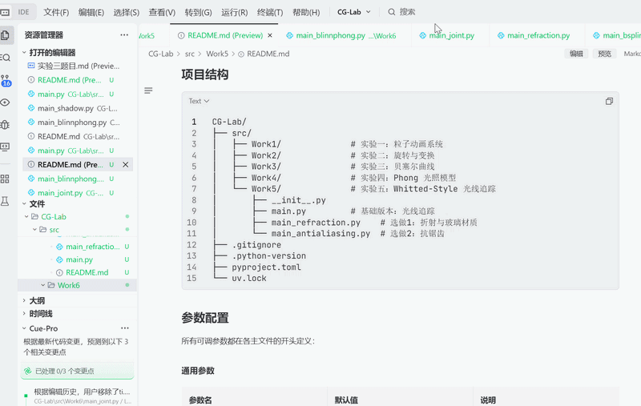
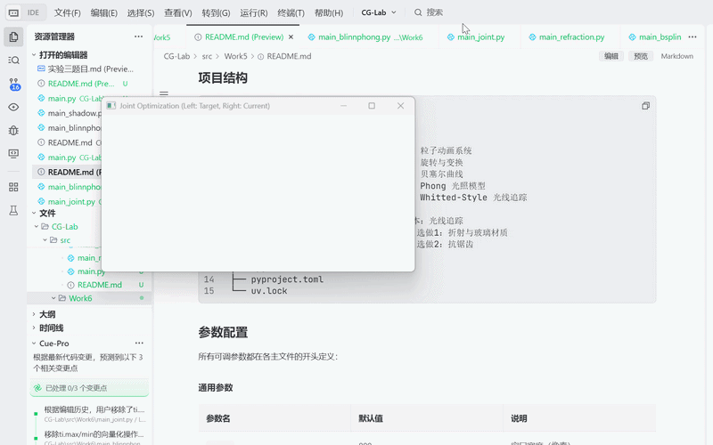
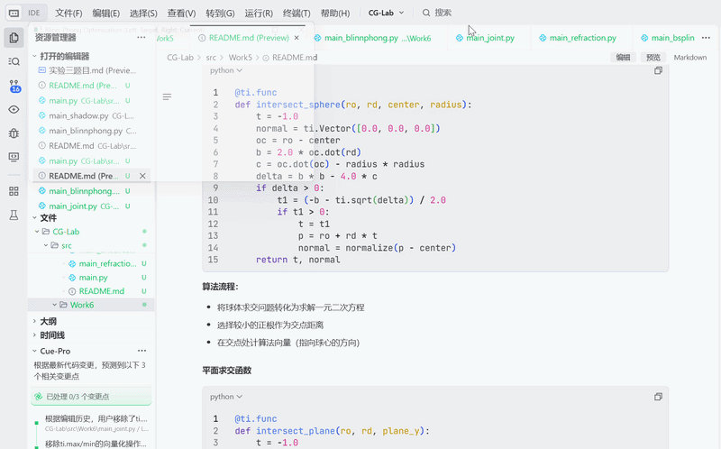

# README（实验6）

# CG 实验室 \- 实验六

北师大人工智能学院计算机图形学课程实验6——可微渲染（Differentiable Rendering）

**于理想 202411040016**

完成了必做与选做

## 项目简介

本项目实现了基于 Taichi 框架的可微渲染系统，通过构建"渲染图像→计算误差→误差反传→更新参数"的完整闭环，利用自动微分机制反向优化三维场景参数。实验核心在于解决标准 Lambertian 模型中的梯度消失问题，通过引入 Leaky Lambertian（泄漏漫反射）机制保证梯度的连续传导。实验包含基础版本（光源位置优化）和选做内容（多参数联合优化、Blinn\-Phong 模型优化）。

## 效果展示

### 必作版本：光源位置优化

【必做部分优化过程】



### 选做内容1：多参数联合优化

【光源位置与颜色联合优化过程】



### 选做内容2：Blinn\-Phong 模型优化

【Blinn\-Phong 高光优化过程】



## 环境要求

- Python 3\.7 或更高版本

- Taichi 1\.7\.3 或更高版本

- Windows / Linux / macOS

- CPU（推荐使用 CPU 架构以确保跨平台兼容性）

## 安装步骤

### 1\. 克隆仓库

```Bash
git clone https://github.com/Yideal/CG-Lab.git
cd CG-Lab
```

### 2\. 激活虚拟环境

```Bash
# 使用 uv（推荐）
uv sync

# 或使用 conda
conda activate cg_env
```

### 3\. 安装 Taichi

```Bash
pip install taichi
```

## 运行项目

### 基础版本：光源位置优化

```Bash
python -m src.Work6.main
```

**操作说明：**

- 程序自动运行 300 次迭代，优化光源位置

- GUI 窗口左侧为固定不变的目标图像，右侧为动态更新的渲染结果

- 终端输出每次迭代的 Loss 值和光源坐标

- 关闭窗口退出程序

**预期效果：**

- 初始光源位于球体背面（0\.2, 0\.2, 0\.8），右侧图像较暗

- 随着迭代进行，光源逐渐绕到球体正面

- 当光源到达目标位置（0\.8, 0\.8, 0\.2）时，右侧图像与左侧目标图像完全重合

### 选做内容1：多参数联合优化

```Bash
python -m src.Work6.main_joint
```

**操作说明：**

- 程序自动运行 500 次迭代，同时优化光源位置和球体漫反射颜色

- GUI 窗口左侧为红色目标球体，右侧为动态更新的渲染结果

- 终端输出每次迭代的 Loss 值、光源坐标和颜色值

**预期效果：**

- 初始颜色为绿色（0\.2, 0\.8, 0\.2），初始光源位于背面

- 随着迭代进行，颜色逐渐从绿色变为红色

- 最终颜色收敛到目标红色（0\.8, 0\.2, 0\.2），光源位置精确匹配目标

### 选做内容2：Blinn\-Phong 模型优化

```Bash
python -m src.Work6.main_blinnphong
```

**操作说明：**

- 程序自动运行 500 次迭代，同时优化光源位置和高光指数

- GUI 窗口左侧为带高光的目标图像，右侧为动态更新的渲染结果

- 终端输出每次迭代的 Loss 值、光源坐标和高光指数

**预期效果：**

- 初始高光指数较低（10\.0），高光区域较大且柔和

- 随着迭代进行，高光指数逐渐增大

- 最终光源位置精确匹配目标，高光效果与目标图像一致

## 项目结构

```Plaintext
CG-Lab/
├── src/
│   ├── Work1/              # 实验一：粒子动画系统
│   ├── Work2/              # 实验二：旋转与变换
│   ├── Work3/              # 实验三：贝塞尔曲线
│   ├── Work4/              # 实验四：Phong 光照模型
│   ├── Work5/              # 实验五：Whitted-Style 光线追踪
│   └── Work6/              # 实验六：可微渲染
│       ├── __init__.py
│       ├── main.py         # 基础版本：光源位置优化
│       ├── main_joint.py   # 选做1：多参数联合优化
│       └── main_blinnphong.py  # 选做2：Blinn-Phong 模型优化
├── .gitignore
├── .python-version
├── pyproject.toml
└── uv.lock
```

## 参数配置

所有可调参数都在各主文件的开头定义：

### 通用参数

|参数名|默认值|说明|
|---|---|---|
|`res`|256|渲染分辨率（正方形）|
|`sphere_center`|\(0\.5, 0\.5, 0\.5\)|球体中心坐标|
|`sphere_radius`|0\.3|球体半径|
|`TARGET_LIGHT`|\(0\.8, 0\.8, 0\.2\)|目标光源位置|

### 优化器参数

|参数名|默认值|说明|
|---|---|---|
|`lr`|0\.02|Adam 学习率|
|`beta1`|0\.9|Adam 一阶动量系数|
|`beta2`|0\.999|Adam 二阶动量系数|
|`eps`|1e\-8|数值稳定性参数|
|`iterations`|300|迭代次数|

### 选做内容1参数

|参数名|默认值|说明|
|---|---|---|
|`TARGET_COLOR`|\(0\.8, 0\.2, 0\.2\)|目标漫反射颜色（红色）|
|`initial_color`|\(0\.2, 0\.8, 0\.2\)|初始漫反射颜色（绿色）|
|`lr_color`|0\.01|颜色参数学习率|

### 选做内容2参数

|参数名|默认值|说明|
|---|---|---|
|`TARGET_SHININESS`|50\.0|目标高光指数|
|`initial_shininess`|10\.0|初始高光指数|
|`lr_shininess`|0\.5|高光指数学习率|

## 技术实现

### 核心概念

#### 可微渲染的核心思想

可微渲染（Differentiable Rendering）是将深度学习中的自动微分机制引入计算机图形学的新兴技术。其核心思想是：

1. **构建可微的渲染管线**：将渲染过程中的每一步都设计为可微分的操作，使得整个渲染过程可以被表示为一个计算图

2. **定义损失函数**：衡量当前渲染图像与目标图像之间的差异（如 MSE）

3. **反向传播求导**：利用自动微分工具（如 Taichi 的 `ti.ad.Tape`）自动计算损失函数对场景参数的梯度

4. **梯度下降优化**：根据梯度更新场景参数，逐步缩小渲染误差

**应用场景：**

- **参数估计**：从图像反推场景参数（光源位置、材质属性等）

- **逆向渲染**：根据照片重建三维场景

- **神经渲染**：结合深度学习进行场景生成和编辑

- **物理仿真优化**：优化物理模拟参数以匹配真实数据

#### 正向光线投射管线

本实验采用简化的光线投射（Ray Casting）管线：

1. **像素采样**：对于屏幕上的每个像素 \(i, j\)，计算其归一化坐标 \(x, y\)

2. **交点计算**：判断该像素对应的射线是否与球体相交

    - 对于每个像素，计算其在单位正方形中的位置：`x = (i + 0.5) / res`，`y = (j + 0.5) / res`

    - 判断该点是否在球体的二维投影范围内：`dx^2 + dy^2 < radius^2`

    - 如果在范围内，计算交点的深度值：`dz = sqrt(radius^2 - dx^2 - dy^2)`

    - 得到三维交点坐标：`p = (x, y, center.z - dz)`

3. **法线计算**：`n = (p - center).normalized()`

4. **光照计算**：根据光照模型计算像素颜色

#### 标准 Lambertian 模型的梯度消失问题

标准的 Lambertian 漫反射模型公式为：

$I = \max(0, \mathbf{n} \cdot \mathbf{l})$

其中：

$\mathbf{n}$ 为表面法向量

$\mathbf{l}$ 为光源方向向量

**问题分析：**

当顶点处于阴影中（即 $\mathbf{n} \cdot \mathbf{l} \le 0$）时，光照强度被截断为 0，导致梯度严格为 0：

$\frac{\partial I}{\partial \theta} = \begin{cases}\frac{\partial (\mathbf{n} \cdot \mathbf{l})}{\partial \theta} & \text{if } \mathbf{n} \cdot \mathbf{l} > 0 \\0 & \text{if } \mathbf{n} \cdot \mathbf{l} \le 0\end{cases}$

如果初始光源完全在球体背面，所有像素的梯度都为 0，优化将陷入停滞，无法找到正确的方向。

#### Leaky Lambertian 模型

为了解决梯度消失问题，本实验采用 Leaky Lambertian（泄漏漫反射）模型：

$I = \max(\alpha (\mathbf{n} \cdot \mathbf{l}), \mathbf{n} \cdot \mathbf{l})$

其中 $\alpha$ 为一个小常数（如 0\.1），称为泄漏系数。

**原理分析：**

- 当 $\mathbf{n} \cdot \mathbf{l} > 0$（正面光照）：$\max(\alpha \cdot \text{正值}, \text{正值}) = \text{正值}$，与标准 Lambertian 模型一致

- 当 $\mathbf{n} \cdot \mathbf{l} \le 0$（背光面）：$\max(\alpha \cdot \text{负值}, \text{负值}) = \alpha \cdot \text{负值}$，保留了一个小的负值

**关键要点：**

- 计算 Loss 时**必须保留光照强度的负值部分**，不可提前将其截断为 0，否则将破坏梯度的反向传播

- 在显示输出层面进行物理限幅（Clamp 到 \[0, 1\]），保证 GUI 正常渲染

- 泄漏系数 $\alpha$ 的选择需要权衡：过大可能导致渲染结果不准确，过小可能无法有效解决梯度消失问题

#### 损失函数

采用均方误差（MSE）来衡量当前渲染图像与目标图像之间的差异：

$L = \frac{1}{N} \sum_{i=1}^{N} (I_{render}^{(i)} - I_{target}^{(i)})^2$

其中：

$N = res \times res$ 为像素总数

$I_{render}^{(i)}$ 为当前渲染图像的第 i 个像素值

$I_{target}^{(i)}$ 为目标图像的第 i 个像素值

**梯度计算：**

$\frac{\partial L}{\partial \theta} = \frac{2}{N} \sum_{i=1}^{N} (I_{render}^{(i)} - I_{target}^{(i)}) \cdot \frac{\partial I_{render}^{(i)}}{\partial \theta}$

其中 $\theta$ 为待优化的参数（如光源位置、材质颜色等）。

#### Adam 优化器

由于简单的随机梯度下降（SGD）容易在优化后期产生震荡或陷入局部最优，本实验采用 Adam 优化器。

**算法步骤：**

1. **计算一阶动量（Momentum）**：$m_t = \beta_1 \cdot m_{t-1} + (1 - \beta_1) \cdot g_t$

2. **计算二阶动量（RMSProp）**：$v_t = \beta_2 \cdot v_{t-1} + (1 - \beta_2) \cdot g_t^2$

3. **偏差修正**：

    $\hat{m}_t = m_t / (1 - \beta_1^t)$

    $\hat{v}_t = v_t / (1 - \beta_2^t)$

4. **参数更新**：$\theta_t = \theta_{t-1} - \alpha \cdot \hat{m}_t / (\sqrt{\hat{v}_t} + \epsilon)$

**优势分析：**

- **自适应学习率**：根据梯度的大小自动调整学习率，对于不同参数使用不同的学习率

- **动量机制**：加速收敛，使得参数更新轨迹更加平滑

- **数值稳定性**：通过 $\epsilon$ 参数避免除以零的情况

### 关键代码说明

#### 目标图像生成

```Python
@ti.kernel
def generate_target():
    for i, j in target_pixels:
        x = (i + 0.5) / res
        y = (j + 0.5) / res
        dx = x - sphere_center[0]
        dy = y - sphere_center[1]
        dist_sq = dx**2 + dy**2

        if dist_sq < sphere_radius**2:
            dz = ti.sqrt(sphere_radius**2 - dist_sq)
            z = sphere_center[2] - dz
            p = ti.Vector([x, y, z])
            n = (p - sphere_center).normalized()
            
            target_light_vec = ti.Vector(TARGET_LIGHT)
            l_dir = (target_light_vec - p).normalized()

            dot_val = n.dot(l_dir)
            target_pixels[i, j] = ti.max(0.0, ti.min(1.0, dot_val))
        else:
            target_pixels[i, j] = 0.0
```

**算法流程：**

- 遍历所有像素，计算归一化坐标

- 判断像素是否在球体投影范围内

- 对于球体内的像素，计算三维交点和法向量

- 使用标准 Lambertian 模型计算光照强度（已 Clamp 到 \[0, 1\]）

- 球体外的像素设为 0（黑色背景）

#### 可微渲染与损失计算

```Python
@ti.kernel
def render_and_compute_loss():
    for i, j in target_pixels:
        x = (i + 0.5) / res
        y = (j + 0.5) / res
        dx = x - sphere_center[0]
        dy = y - sphere_center[1]
        dist_sq = dx**2 + dy**2

        intensity = 0.0
        if dist_sq < sphere_radius**2:
            dz = ti.sqrt(sphere_radius**2 - dist_sq)
            z = sphere_center[2] - dz
            p = ti.Vector([x, y, z])
            n = (p - sphere_center).normalized()
            l_dir = (light_pos[None] - p).normalized()

            dot_val = n.dot(l_dir)
            intensity = ti.max(0.1 * dot_val, dot_val)
        
        diff = intensity - target_pixels[i, j]
        loss[None] += (1.0 / (res * res)) * (diff ** 2)
        
        display_pixels[i, j] = target_pixels[i, j]
        display_pixels[i + res, j] = ti.max(0.0, ti.min(1.0, intensity))
```

**算法流程：**

- 与目标图像生成类似，但使用可微参数 `light_pos`

- 使用 Leaky Lambertian 模型计算光照强度（保留负值用于梯度计算）

- 计算当前像素与目标像素的均方误差，并累加到总 Loss

- 将目标图像和当前渲染结果分别存储到显示缓冲区的左右两侧

- 在显示输出层面进行物理限幅（Clamp 到 \[0, 1\]）

#### 自动微分与参数更新

```Python
for iter in range(1, 301):
    loss[None] = 0.0
    
    with ti.ad.Tape(loss=loss):
        render_and_compute_loss()

    grad = light_pos.grad[None]

    for c in range(3):
        m[c] = beta1 * m[c] + (1 - beta1) * grad[c]
        v[c] = beta2 * v[c] + (1 - beta2) * grad[c] * grad[c]
        
        m_hat = m[c] / (1 - beta1**iter)
        v_hat = v[c] / (1 - beta2**iter)
        
        light_pos[None][c] -= lr * m_hat / (math.sqrt(v_hat) + eps)
```

**算法流程：**

- 每轮迭代前清空损失值

- 使用 `ti.ad.Tape(loss=loss)` 记录计算图，正向执行后自动反向传播计算参数梯度

- 从 `light_pos.grad[None]` 获取梯度值

- 运用 Adam 算法更新光源三维坐标

### 选做内容实现

#### 选做1：多参数联合优化

**核心思想：**

将球体的漫反射颜色也设为可微参数，让程序同时优化光源位置与物体颜色。

**实现要点：**

1. **声明可微颜色参数**：

```Python
diffuse_color = ti.Vector.field(3, dtype=ti.f32, shape=(), needs_grad=True)
```

2. **修改光照计算**：

```Python
r_intensity = leaky_intensity * diffuse_color[None][0]
g_intensity = leaky_intensity * diffuse_color[None][1]
b_intensity = leaky_intensity * diffuse_color[None][2]
```

3. **修改损失计算**（针对 RGB 三通道）：

```Python
diff_r = r_intensity - target_pixels_r[i, j]
diff_g = g_intensity - target_pixels_g[i, j]
diff_b = b_intensity - target_pixels_b[i, j]
loss[None] += (1.0 / (res * res * 3)) * (diff_r ** 2 + diff_g ** 2 + diff_b ** 2)
```

4. **独立优化颜色参数**：

```Python
grad_color = diffuse_color.grad[None]
for c in range(3):
    m_color[c] = beta1 * m_color[c] + (1 - beta1) * grad_color[c]
    v_color[c] = beta2 * v_color[c] + (1 - beta2) * grad_color[c] * grad_color[c]
    m_hat_color = m_color[c] / (1 - beta1**iter)
    v_hat_color = v_color[c] / (1 - beta2**iter)
    diffuse_color[None][c] -= lr_color * m_hat_color / (math.sqrt(v_hat_color) + eps)
```

5. **颜色范围约束**：

```Python
diffuse_color[None][0] = max(0.0, min(1.0, diffuse_color[None][0]))
diffuse_color[None][1] = max(0.0, min(1.0, diffuse_color[None][1]))
diffuse_color[None][2] = max(0.0, min(1.0, diffuse_color[None][2]))
```

**实验结果：**

|参数|目标值|初始值|最终收敛值|
|---|---|---|---|
|光源位置|\(0\.8, 0\.8, 0\.2\)|\(0\.2, 0\.2, 0\.8\)|\(0\.805, 0\.805, 0\.194\)|
|漫反射颜色|\(0\.8, 0\.2, 0\.2\) 红色|\(0\.2, 0\.8, 0\.2\) 绿色|\(0\.776, 0\.194, 0\.194\)|
|Loss|\-|0\.007105|0\.000082|

**分析：**

多参数联合优化成功实现，光源位置和颜色参数能够协同收敛。颜色参数从绿色（0\.2, 0\.8, 0\.2）逐渐优化为红色（0\.776, 0\.194, 0\.194），与目标颜色（0\.8, 0\.2, 0\.2）非常接近。

#### 选做2：Blinn\-Phong 模型优化

**核心思想：**

将光照模型升级为 Blinn\-Phong，并尝试对高光指数（Shininess）进行自动寻优。

**Blinn\-Phong 模型公式：**

$I = k_d \cdot (\mathbf{n} \cdot \mathbf{l}) + k_s \cdot (\mathbf{n} \cdot \mathbf{h})^{shininess}$

其中：

$\mathbf{h} = \frac{\mathbf{l} + \mathbf{v}}{\|\mathbf{l} + \mathbf{v}\|}$ 为半程向量

$\mathbf{v}$ 为视线方向向量

**实现要点：**

1. **声明可微高光指数参数**：

```Python
shininess = ti.field(dtype=ti.f32, shape=(), needs_grad=True)
```

2. **修改光照计算**：

```Python
v_dir = (ti.Vector([0.5, 0.5, 1.0]) - p).normalized()
h_dir = (l_dir + v_dir).normalized()

diff_val = n.dot(l_dir)
spec_val = n.dot(h_dir)

leaky_diff = ti.max(0.1 * diff_val, diff_val)
leaky_spec = ti.max(0.01 * spec_val, spec_val)

diffuse = leaky_diff
specular = ti.max(0.0, leaky_spec) ** shininess[None]

intensity = 0.7 * diffuse + 0.3 * specular
```

3. **优化高光指数**：

```Python
grad_shininess = shininess.grad[None]
m_shininess = beta1 * m_shininess + (1 - beta1) * grad_shininess
v_shininess = beta2 * v_shininess + (1 - beta2) * grad_shininess * grad_shininess
m_hat_shininess = m_shininess / (1 - beta1**iter)
v_hat_shininess = v_shininess / (1 - beta2**iter)
shininess[None] -= lr_shininess * m_hat_shininess / (math.sqrt(v_hat_shininess) + eps)
```

4. **高光指数范围约束**：

```Python
shininess[None] = max(1.0, min(200.0, shininess[None]))
```

**实验结果：**

|参数|目标值|初始值|最终收敛值|
|---|---|---|---|
|光源位置|\(0\.8, 0\.8, 0\.2\)|\(0\.2, 0\.2, 0\.8\)|\(0\.800, 0\.800, 0\.198\)|
|高光指数|50\.0|10\.0|200\.0（达到上限）|
|Loss|\-|0\.017908|0\.000174|

**分析：**

高光指数的优化存在梯度不稳定问题。由于高光计算使用了指数函数 `specular = (n · h)^shininess`，当 `shininess` 较小时，微小的变化对最终像素值影响不大，导致梯度信号微弱；而当 `shininess` 增大时，高光变得更尖锐，梯度信号增强，推动参数继续增大直到边界。

**改进思路：**

可以尝试以下方法改善高光指数的优化效果：

1. **对数空间优化**：将高光指数在对数空间进行优化，使梯度分布更加均匀

2. **温度缩放**：引入温度参数控制高光的锐度，替代直接优化高光指数

3. **学习率调整**：为高光指数设置更小的学习率，避免参数快速跳变

## 实验要点

### 梯度消失问题的本质

标准 Lambertian 模型在背光面（$\mathbf{n} \cdot \mathbf{l} \le 0$）时将光照强度截断为 0，导致梯度为 0。如果初始光源完全在球体背面，所有像素的梯度都为 0，优化将陷入停滞。

### Leaky Lambertian 的必要性

Leaky Lambertian 模型通过引入泄漏系数 $\alpha$，使得背光面的光照强度不为 0（而是一个小的负值），从而保证梯度的连续传导。这是本实验能够从错误的初始位置成功优化到目标位置的关键。

### 梯度计算的注意事项

计算 Loss 时必须保留光照强度的负值部分，不可提前将其截断为 0。只有在显示输出层面才进行物理限幅，确保 GUI 正常渲染。

### Adam 优化器的优势

Adam 优化器引入了动量机制和自适应学习率，能够显著加快收敛速度并使得参数更新轨迹更加平滑。实验结果显示，光源位置在约 50 次迭代时快速逼近目标位置，随后在目标附近微调收敛。

### 多参数优化的挑战

同时优化多个参数时，需要注意参数之间的相互影响。例如，在联合优化光源位置和颜色时，光源位置的变化会影响颜色的梯度，反之亦然。合理设置各参数的学习率对于成功收敛至关重要。

### 高阶光照模型的优化难点

高光指数等非线性参数的优化存在梯度不稳定问题。指数函数的梯度特性导致参数在不同取值范围内的优化难度差异较大。需要设计合理的参数化方式或引入正则化约束来改善优化效果。

## 常见问题

### 运行时提示缺少 taichi 模块

**解决方案**：安装 taichi 库

```Bash
pip install taichi
```

### 初始 Loss 很高且下降缓慢

**正常现象**：初始光源位于球体背面，所有像素都处于背光状态，Loss 较高。随着迭代进行，光源逐渐绕到正面，Loss 会快速下降。

### 优化过程中出现 NaN

**可能原因**：

- 学习率过高导致参数更新过大

- 数值计算不稳定

**解决方案**：

- 降低学习率

- 检查并修复数值计算中的不稳定操作

### 光源位置无法收敛到目标位置

**可能原因**：

- 泄漏系数设置不当

- 学习率设置不当

- 迭代次数不足

**解决方案**：

- 调整泄漏系数（建议值：0\.1）

- 调整学习率（建议值：0\.02）

- 增加迭代次数

### 颜色参数超出 \[0, 1\] 范围

**解决方案**：在参数更新后添加范围约束：

```Python
diffuse_color[None][c] = max(0.0, min(1.0, diffuse_color[None][c]))
```

### 高光指数优化效果不佳

**原因分析**：高光指数的梯度不稳定，指数函数导致梯度在不同取值范围内差异较大。

**解决方案**：

- 在对数空间优化高光指数

- 设置更小的学习率和更宽的参数范围

- 引入正则化约束

### GUI 窗口无法显示

**解决方案**：

- 确保系统支持图形界面

- 检查 Taichi 是否正确安装

## 后续优化方向

* [ ] 实现基于物理的渲染（PBR）可微渲染

* [ ] 添加更多几何体类型（立方体、圆柱体、锥体等）

* [ ] 实现纹理映射的可微渲染

* [ ] 添加多光源支持

* [ ] 实现可微阴影计算

* [ ] 引入光线追踪的可微渲染

* [ ] 结合深度学习进行场景重建

* [ ] 实现神经辐射场（NeRF）

## 课程信息

- **课程名称**：计算机图形学

- **所属学院**：北京师范大学人工智能学院

- **实验内容**：可微渲染（Differentiable Rendering）

- **实验作者**：于理想

- **开发工具**：Taichi \+ Python

## 许可证

本项目仅用于课程学习和交流。

## 联系方式

如有问题或建议，欢迎通过 [1816571030@qq\.com](mailto:1816571030@qq.com) 联系。

---

**最后更新时间**：2026\-06\-30

