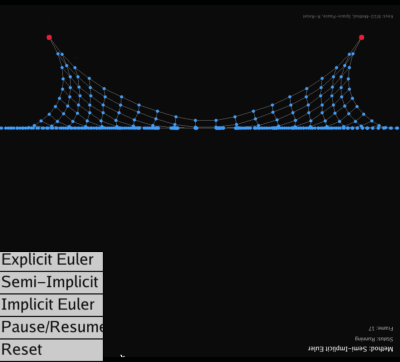
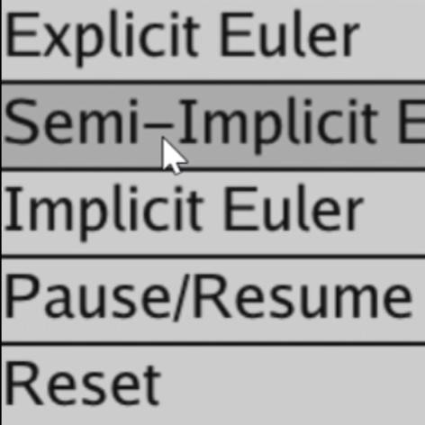

# README（实验7）

# CG 实验室 \- 实验七

北师大人工智能学院计算机图形学课程实验7——质点\-弹簧系统

**于理想 202411040016**

完成了必做与选做

## 项目简介

本项目实现了基于 Taichi 框架的质点\-弹簧物理模拟系统，通过 GPU 并行计算实现了高效的布料变形模拟。实验包含基础版本（结构弹簧）、选做内容1（完善弹簧模型）和选做内容2（空间碰撞检测）。系统实现了三种数值积分方法（显式欧拉、半隐式欧拉、隐式欧拉）的对比，并通过 GGUI 交互面板实现了实时控制和可视化。

## 效果展示

### 必做部分：结构弹簧模型

【运行gif】




### 三种积分方法对比

#### 阻尼系数 k\_d = 1\.0

|方法|效果描述|截图|
|---|---|---|
|显式欧拉|系统很快发散，质点速度急剧增大，布料飞散|【显式欧拉效果截图】|
|半隐式欧拉|系统稳定，布料自然下垂并摆动，最终达到平衡|【半隐式欧拉效果截图】|
|隐式欧拉|系统最稳定，布料摆动衰减较快，呈现阻尼效果|【隐式欧拉效果截图】|

#### 阻尼系数 k\_d = 5\.0

|方法|效果描述|截图|
|---|---|---|
|显式欧拉|发散速度略有减缓，但仍不稳定|【显式欧拉阻尼5\.0截图】|
|半隐式欧拉|摆动幅度明显减小，更快达到平衡状态|【半隐式欧拉阻尼5\.0截图】|
|隐式欧拉|阻尼效果更加明显，几乎无摆动|【隐式欧拉阻尼5\.0截图】|

### 选做内容1：完善弹簧模型

【完整弹簧模型效果】


### 选做内容2：空间碰撞检测

【碰撞检测效果】


### GUI 控制面板

【GUI 控制面板】



## 环境要求

- Python 3\.9 或更高版本

- Taichi 1\.7\.4 或更高版本

- NumPy（用于旧的 GUI API，仅 main\_collision\.py）

- Windows / Linux / macOS

- GPU 支持（推荐）或 CPU

## 安装步骤

### 1\. 克隆仓库

```Bash
git clone https://github.com/Yideal/CG-Lab.git
cd CG-Lab
```

### 2\. 激活虚拟环境

```Bash
# 使用 uv（推荐）
uv sync

# 或使用 conda
conda activate cg_env
```

### 3\. 安装 NumPy（选做内容2需要）

```Bash
pip install numpy
```

## 运行项目

### 基础版本：结构弹簧模型

```Bash
# 使用 uv
uv run -m src.Work7.main

# 或直接使用虚拟环境中的 Python
python -m src.Work7.main
```

**操作说明：**

- 点击左上角按钮切换积分方法：

    - `Explicit Euler (Explosive)`：显式欧拉方法

    - `Semi-Implicit Euler (Stable)`：半隐式欧拉方法

    - `Implicit Euler (Damped)`：隐式欧拉方法

- `Pause Simulation / Resume Simulation`：暂停或恢复模拟

- `Reset Cloth`：重置布料到初始状态

- 鼠标右键拖动：旋转视角

- `Esc` 键：退出程序

**键盘快捷键：**

- `0`：切换到显式欧拉方法

- `1`：切换到半隐式欧拉方法

- `2`：切换到隐式欧拉方法

- `Space`：暂停/恢复模拟

- `R`：重置布料

### 选做内容1：完善弹簧模型

```Bash
# 使用 uv
uv run -m src.Work7.main_springs

# 或直接使用虚拟环境中的 Python
python -m src.Work7.main_springs
```

**操作说明：**与基础版本相同，但布料包含结构弹簧、剪切弹簧和弯曲弹簧，模拟更加真实。

### 选做内容2：空间碰撞检测

```Bash
# 使用 uv
uv run -m src.Work7.main_collision

# 或直接使用虚拟环境中的 Python
python -m src.Work7.main_collision
```

**操作说明：**

- 点击按钮切换积分方法

- `Pause/Resume`：暂停或恢复模拟

- `Reset`：重置布料到初始状态

- `Esc` 键：退出程序

**显示说明：**

- 蓝色圆点：普通质点

- 黄色圆点：固定点

- 灰色线条：弹簧连接

- 红色圆形：碰撞球体

## 项目结构

```Plaintext
CG-Lab/
├── src/
│   ├── Work1/              # 实验一：粒子动画系统
│   ├── Work2/              # 实验二：旋转与变换
│   ├── Work3/              # 实验三：贝塞尔曲线
│   ├── Work4/              # 实验四：Phong 光照模型
│   ├── Work5/              # 实验五
│   ├── Work6/              # 实验六：可微渲染
│   └── Work7/              # 实验七：质点-弹簧系统
│       ├── README.md       # 本文件
│       ├── main.py         # 基础版本：结构弹簧模型
│       ├── main_springs.py # 选做1：完善弹簧模型
│       └── main_collision.py   # 选做2：空间碰撞检测
├── .gitignore
├── .python-version
├── pyproject.toml
└── uv.lock
```

## 参数配置

所有可调参数都在各主文件的开头定义：

### 通用物理参数

|参数名|默认值|说明|
|---|---|---|
|`N`|20|布料网格分辨率 N x N|
|`mass`|1\.0|质点质量|
|`dt`|5e\-4|时间步长|
|`k_s`|10000\.0|弹簧劲度系数（基础版本）|
|`k_d`|1\.0|阻尼系数|
|`gravity`|\(0, \-9\.8, 0\)|重力加速度|
|`max_velocity`|50\.0|速度上限，防止数值爆炸|

### 选做内容1：完善弹簧模型参数

|参数名|默认值|说明|
|---|---|---|
|`k_s_structural`|10000\.0|结构弹簧刚度|
|`k_s_shear`|5000\.0|剪切弹簧刚度|
|`k_s_bending`|2000\.0|弯曲弹簧刚度|

### 选做内容2：空间碰撞参数

|参数名|默认值|说明|
|---|---|---|
|`sphere_center`|\(0, \-0\.2, 0\)|碰撞球体中心|
|`sphere_radius`|0\.4|碰撞球体半径|
|`restitution`|0\.8|碰撞能量衰减系数|

### 调整建议

- **性能优化**：如果运行卡顿，将 `N` 减小到 15 或 12

- **稳定性**：显式欧拉方法容易发散，增大 `k_d` 或减小 `dt` 可以提高稳定性

- **视觉效果**：增大 `k_s` 可以让布料更加僵硬，减小 `k_s` 可以让布料更加柔软

## 技术实现

### 核心概念

#### 质点\-弹簧模型

质点\-弹簧系统是计算机图形学中最经典的变形体模拟方法之一。我们将布料离散化为网格状的质点集合，质点之间通过弹簧相连（本实验基础要求实现**结构弹簧**）。

根据胡克定律 \(Hooke's Law\)，两个质点 $x_a$ 和 $x_b$ 之间的弹力公式为：

$f_a = -k_s (|x_a - x_b| - l) \frac{x_a - x_b}{|x_a - x_b|}$

阻尼力公式为：

$f_d = -k_d v_a$

合力计算：

$F_{total} = f_g + f_d + \sum f_{spring}$

#### 数值积分方法

**显式欧拉 \(Explicit Euler\)**：完全使用当前时刻的状态来预测下一时刻。

$x_{t+1} = x_t + v_t \Delta t$
$v_{t+1} = v_t + a_t \Delta t$

**半隐式欧拉 \(Semi\-Implicit Euler\)**：先更新速度，然后使用更新后的速度来更新位置。

$v_{t+1} = v_t + a_t \Delta t$
$x_{t+1} = x_t + v_{t+1} \Delta t$

**隐式欧拉 \(Implicit Euler\)**：使用未来时刻的状态来计算受力，本实验采用定点迭代法近似求解。

$v_{t+1} = v_t + a_{t+1} \Delta t$
$x_{t+1} = x_t + v_{t+1} \Delta t$

#### GPU 并行计算基础

Taichi 提供了 `ti.kernel` 和 `ti.func` 两种函数声明方式：

- **`ti.kernel`**：声明一个可以在 GPU 上并行执行的核函数

- **`ti.func`**：声明一个内联函数，编译器会将其代码直接插入到调用它的 kernel 中

**GPU 同步机制**：

- 将初始化操作拆分为多个 kernel，确保每个阶段的计算完成后再进行下一阶段

- 使用 `ti.atomic_add` 保证多个线程同时写入同一内存位置时的安全性

### 关键代码说明

#### 力计算函数

```Python
@ti.func
def compute_forces_on(pos: ti.template(), vel: ti.template(), force: ti.template()):
    """计算所有力（重力 + 阻尼 + 弹簧力）"""
    for i in range(N * N):
        force[i] = gravity * mass - k_d * vel[i]
    for i in range(num_springs[None]):
        idx_a = spring_pairs[i][0]
        idx_b = spring_pairs[i][1]
        pos_a = pos[idx_a]
        pos_b = pos[idx_b]
        d = pos_a - pos_b
        dist = d.norm()
        if dist > 1e-6:
            d_normalized = d / dist
            f_spring = -k_s * (dist - spring_lengths[i]) * d_normalized
            ti.atomic_add(force[idx_a], f_spring)
            ti.atomic_add(force[idx_b], -f_spring)
```

**关键技术点：**

- 使用 `ti.func` 声明，编译器会将其强制内联到调用它的 Kernel 中，减少 GPU 函数调用开销

- 第一阶段：对每个质点独立计算重力和阻尼力，无数据竞争

- 第二阶段：遍历所有弹簧，计算弹力并使用 `ti.atomic_add` 累加到两个质点的力场中

#### 速度钳制函数

```Python
@ti.func
def clamp_velocity(vel: ti.template(), idx: int):
    """速度钳制，防止数值爆炸"""
    vel_norm = vel[idx].norm()
    if vel_norm > max_velocity:
        vel[idx] = vel[idx] / vel_norm * max_velocity
```

**原理：**当质点速度超过阈值时，将其归一化到最大速度，保持速度方向不变。这是防止数值爆炸的关键手段。

#### 显式欧拉实现

```Python
@ti.kernel
def step_explicit():
    """显式欧拉（Explicit Euler）- 极易发散"""
    compute_forces_on(x, v, f)
    for i in range(N * N):
        if is_fixed[i] == 0:
            x[i] += v[i] * dt
            v[i] += (f[i] / mass) * dt
            clamp_velocity(v, i)
```

**稳定性分析：**显式欧拉使用旧状态计算新状态，误差会随时间累积。当时间步长超过临界值时，误差会指数增长，导致系统发散。

#### 半隐式欧拉实现

```Python
@ti.kernel
def step_semi_implicit():
    """半隐式欧拉（Semi-Implicit Euler）- 相对稳定"""
    compute_forces_on(x, v, f)
    for i in range(N * N):
        if is_fixed[i] == 0:
            v[i] += (f[i] / mass) * dt
            clamp_velocity(v, i)
            x[i] += v[i] * dt
```

**稳定性分析：**半隐式欧拉的关键改进在于使用更新后的速度来更新位置。这种顺序改变使得方法具有更好的稳定性，能够处理较大的时间步长。

#### 隐式欧拉实现

```Python
@ti.kernel
def step_implicit_iter():
    """隐式欧拉（Implicit Euler）- 使用定点迭代法近似求解"""
    for i in range(N * N):
        v_next[i] = v[i]
        x_next[i] = x[i]
    for _ in ti.static(range(3)):
        compute_forces_on(x_next, v_next, f_next)
        for i in range(N * N):
            if is_fixed[i] == 0:
                v_next[i] = v[i] + (f_next[i] / mass) * dt
                clamp_velocity(v_next, i)
                x_next[i] = x[i] + v_next[i] * dt
    for i in range(N * N):
        v[i] = v_next[i]
        x[i] = x_next[i]
```

**实现要点：**

- 使用 `ti.static(range(3))` 在编译期展开迭代循环，消除运行时循环开销

- 每次迭代都使预测值更加接近真实解

- 隐式欧拉是无条件稳定的，即使在非常大的时间步长下也不会发散

### 选做内容实现

#### 选做1：完善弹簧模型

在结构弹簧的基础上，补充剪切弹簧和弯曲弹簧：

```Python
@ti.kernel
def init_springs():
    for i, j in ti.ndrange(N, N):
        idx = i * N + j
        # 结构弹簧（水平和垂直方向）
        if i < N - 1:
            idx_right = (i + 1) * N + j
            c = ti.atomic_add(num_springs[None], 1)
            spring_pairs[c] = ti.Vector([idx, idx_right])
            spring_lengths[c] = (x[idx] - x[idx_right]).norm()
            spring_stiffness[c] = k_s_structural
        # 剪切弹簧（对角线方向）
        if i < N - 1 and j < N - 1:
            idx_diag = (i + 1) * N + (j + 1)
            c = ti.atomic_add(num_springs[None], 1)
            spring_pairs[c] = ti.Vector([idx, idx_diag])
            spring_lengths[c] = (x[idx] - x[idx_diag]).norm()
            spring_stiffness[c] = k_s_shear
        # 弯曲弹簧（间隔一个质点）
        if i < N - 2:
            idx_double_right = (i + 2) * N + j
            c = ti.atomic_add(num_springs[None], 1)
            spring_pairs[c] = ti.Vector([idx, idx_double_right])
            spring_lengths[c] = (x[idx] - x[idx_double_right]).norm()
            spring_stiffness[c] = k_s_bending
```

**弹簧类型说明：**

|弹簧类型|连接方式|刚度系数|作用|
|---|---|---|---|
|结构弹簧|水平和垂直相邻|10000|维持布料的基本形状和尺寸|
|剪切弹簧|对角线相邻|5000|防止布料产生剪切变形|
|弯曲弹簧|间隔一个质点|2000|增加布料的弯曲刚度|

#### 选做2：空间碰撞检测

```Python
@ti.func
def handle_sphere_collision(pos: ti.template(), vel: ti.template(), idx: int):
    center = sphere_center[None]
    radius = sphere_radius[None]
    p = pos[idx]
    d = p - center
    dist = d.norm()

    if dist < radius:
        normal = d / dist
        pos[idx] = center + normal * (radius + 1e-4)
        vel[idx] = vel[idx] - vel[idx].dot(normal) * normal * 0.8
```

**碰撞处理流程：**

1. 计算质点到球心的向量和距离

2. 判断距离是否小于球半径（即是否发生碰撞）

3. 如果发生碰撞：

    - **位置修正**：将穿透的质点沿法向量外推至球表面

    - **速度反射**：将速度的法向分量取反并乘以 0\.8（能量衰减系数）

### GGUI 交互实现

使用 Taichi 的 `ti.ui.Window`（GGUI）构建 3D 场景和控制面板：

```Python
window.GUI.begin("Control Panel", 0.02, 0.02, 0.38, 0.36)

window.GUI.text("Integration Method:")

prefix_0 = "[*] " if current_method == 0 else "[ ] "
prefix_1 = "[*] " if current_method == 1 else "[ ] "
prefix_2 = "[*] " if current_method == 2 else "[ ] "

if window.GUI.button(prefix_0 + "Explicit Euler (Explosive)"):
    current_method = 0
    init_cloth()

window.GUI.end()
```

**优势：**

- 无需手动实现投影和绘制函数

- 内置的 3D 渲染管线提供更好的视觉效果

- 支持光照、相机交互等高级功能

- 代码更加简洁易读

## 实验要点

### GPU 同步机制

将初始化操作拆分为多个 Kernel，确保 GPU 状态同步：

```Python
def init_cloth():
    num_springs[None] = 0
    init_positions()
    init_springs()
    init_spring_indices()
```

Taichi 保证 kernel 之间的执行顺序，即 `init_positions` 完成后才会执行 `init_springs`。

### Kernel 合并优化

将受力计算和位置/速度更新合并在同一个 Kernel 中，减少 GPU 启动开销。每次 Kernel 启动都有一定的固定开销，合并计算可以显著减少启动次数。

### 原子操作的使用

使用 `ti.atomic_add` 保证多个线程同时写入同一内存位置时的安全性，避免竞态条件：

```Python
ti.atomic_add(force[idx_a], f_spring)
ti.atomic_add(force[idx_b], -f_spring)
```

### 速度钳制的重要性

速度钳制是防止数值爆炸的关键手段，特别是对于显式欧拉方法。当质点速度超过阈值时，将其归一化到最大速度。

### 定点迭代展开

使用 `ti.static(range(3))` 在编译期展开迭代循环，消除运行时循环开销：

```Python
for _ in ti.static(range(3)):
    compute_forces_on(x_next, v_next, f_next)
```

## 实验结果分析

### 三种积分方法的稳定性对比

通过实验观察，三种积分方法表现出明显不同的稳定性特征：

|特性|显式欧拉|半隐式欧拉|隐式欧拉|
|---|---|---|---|
|稳定性|条件稳定|较好稳定|无条件稳定|
|能量守恒|较差|较好|较差（数值阻尼）|
|计算复杂度|O\(1\)|O\(1\)|O\(n\)（n为迭代次数）|
|适用场景|低刚度系统|一般场景|高刚度系统|

### 显式欧拉

- **稳定性**：条件稳定，在较小的阻尼系数下，系统很快就会发散

- **原因**：显式欧拉使用旧状态计算新状态，误差会随时间累积

- **改进**：增大阻尼系数可以减缓发散速度，但无法从根本上解决稳定性问题

### 半隐式欧拉

- **稳定性**：表现出较好的稳定性，即使在较小阻尼下也能保持系统稳定

- **原因**：半隐式欧拉通过先更新速度再更新位置，使得位置更新使用的是新速度

- **能量特性**：半隐式欧拉是一种辛积分方法，能够较好地保持系统的能量守恒

### 隐式欧拉

- **稳定性**：最稳定的方法，即使在非常大的时间步长下也不会发散

- **原因**：隐式欧拉使用未来状态近似求解，通过定点迭代法逼近真实解

- **能量特性**：由于使用了近似求解，隐式欧拉会表现出一定的数值阻尼效果

### GPU 编程的性能优化

在本实验中，通过以下方式优化 GPU 计算性能：

1. **Kernel 合并**：将受力计算和位置/速度更新合并在同一个 Kernel 中，减少 GPU 启动开销

2. **ti\.func 内联**：使用 `ti.func` 声明力计算函数，编译器会将其内联到调用它的 Kernel 中，避免函数调用开销

3. **数据布局优化**：使用 Taichi 的 `ti.Vector.field` 和 `ti.field` 定义数据场，确保数据在 GPU 上的高效访问

4. **GPU 同步**：将初始化操作拆分为多个 Kernel，确保 GPU 状态同步

5. **定点迭代展开**：使用 `ti.static(range(3))` 在编译期展开迭代循环，消除运行时循环开销

## 常见问题

### 运行时提示缺少 taichi 模块

**解决方案**：安装 taichi 库

```Bash
pip install taichi
```

### 显式欧拉方法布料飞散

**可能原因：**

1. 时间步长过大

2. 弹簧劲度系数过大

3. 阻尼系数过小

**解决方案：**

- 减小 `dt` 参数

- 减小 `k_s` 参数

- 增大 `k_d` 参数

### 半隐式欧拉方法布料摆动过大

**可能原因：**阻尼系数过小

**解决方案：**增大 `k_d` 参数，或切换到隐式欧拉方法

### 隐式欧拉方法布料过于僵硬

**可能原因：**数值阻尼过大

**解决方案：**增加迭代次数，或减小时间步长

### GPU 初始化失败

**解决方案：**Taichi 会自动回退到 CPU 模式，虽然性能稍差但仍可正常运行。检查显卡驱动是否正确安装。

### 程序运行很卡

**可能原因：**

1. 网格分辨率过大

2. GPU 内存带宽不足

**解决方案：**

- 减小 `N` 参数（如改为 15 或 12）

- 使用 CPU 模式运行（修改 `ti.init(arch=ti.cpu)`）

### GUI 控制面板无响应

**可能原因：**窗口没有获得焦点

**解决方案：**点击窗口确保获得焦点

## 后续优化方向

* [ ] 实现自适应时间步长控制

* [ ] 添加更多约束类型（距离约束、角度约束）

* [ ] 实现自碰撞检测（布料自身碰撞）

* [ ] 添加纹理映射和着色效果

* [ ] 实现风力模拟

* [ ] 添加布料撕裂效果

* [ ] 支持用户自定义布料形状

* [ ] 实现更高级的碰撞检测（AABB、BVH）

## 课程信息

- **课程名称**：计算机图形学

- **所属学院**：北京师范大学人工智能学院

- **实验内容**：质点\-弹簧系统

- **实验作者**：于理想

- **开发工具**：Taichi \+ Python

## 许可证

本项目仅用于课程学习和交流。

## 联系方式

如有问题或建议，欢迎通过 [1816571030@qq\.com](mailto:1816571030@qq.com) 联系。

---

**最后更新时间**：2026\-06\-30

