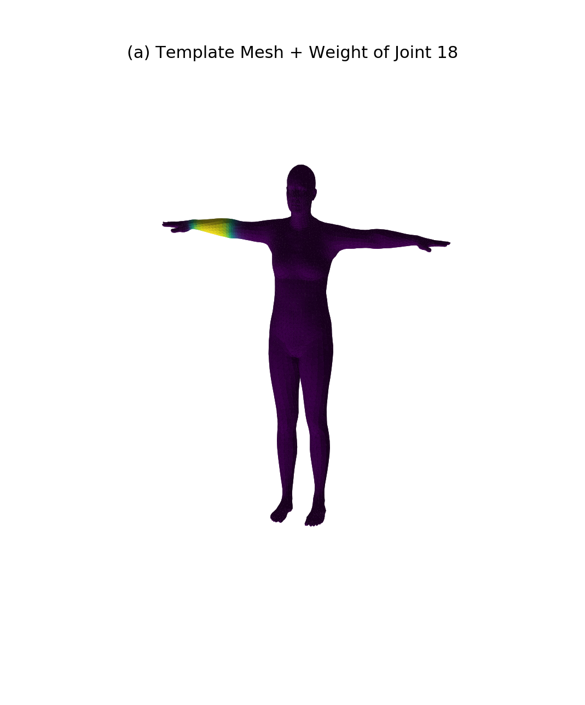
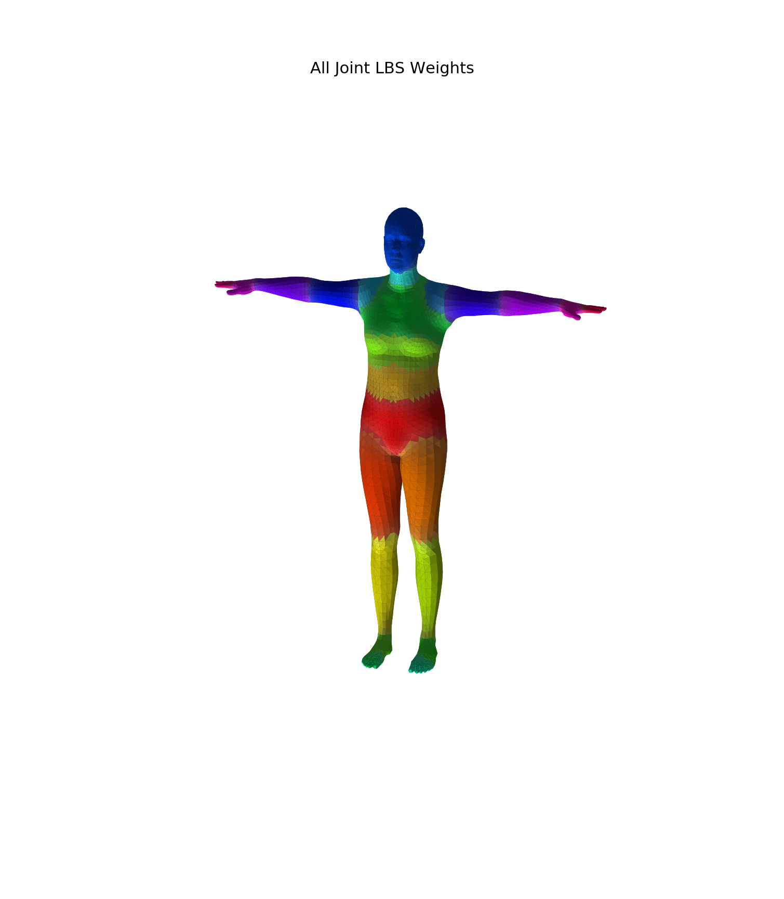
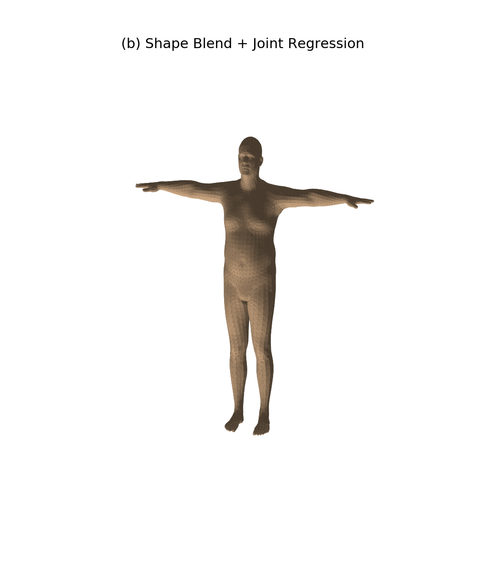
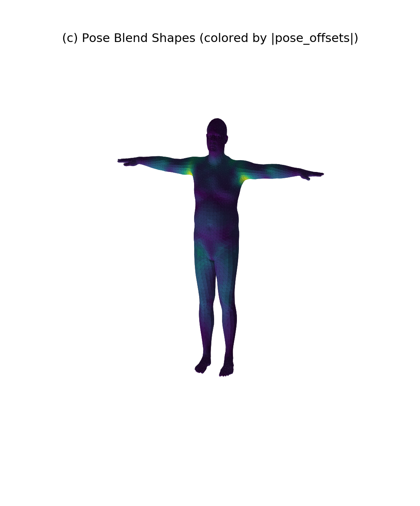
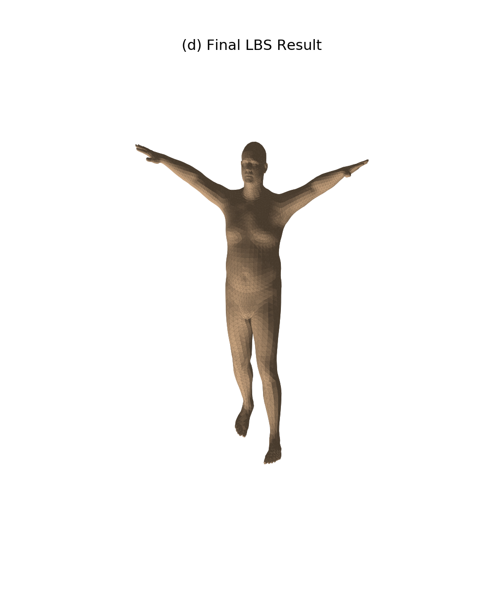
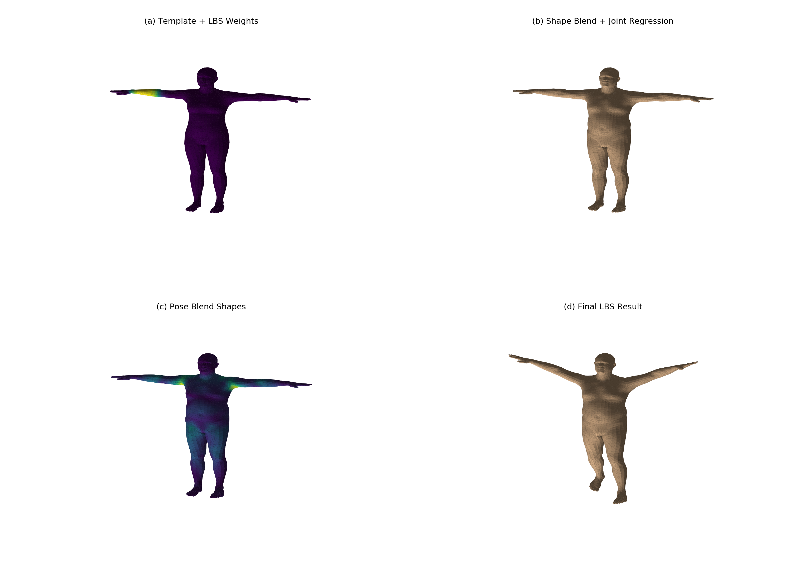
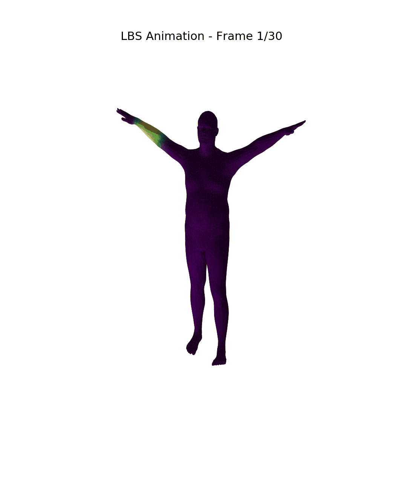

# README（实验8）

# CG 实验室 \- 实验八

北师大人工智能学院计算机图形学课程实验8——LBS（Linear Blend Skinning）蒙皮可视化

**于理想 202411040016**

完成了必做与选做

（由于这个实验生成图片较多，因此将图片插入了对应任务的描述处，没有像之前一样放在最前面供预览）

## 实验目标

本实验基于 **SMPL 模型** 完成一次完整的 **LBS \(Linear Blend Skinning\)** 蒙皮过程可视化。具体目标为：

1. 理解参数化人体模型中模板网格、形状参数、姿态参数、关节回归器和蒙皮权重之间的关系。

2. 理解 LBS 四个阶段：

    - **\(a\)** 模板网格$\bar{T}$与蒙皮权重$\mathcal{W}$

    - **\(b\)** 形状校正后网格$\bar{T} + B_S(\beta)$以及关节$J(\beta)$

    - **\(c\)** 姿态校正后网格$T_P(\beta,\theta)=\bar{T}+B_S(\beta)+B_P(\theta)$

    - **\(d\)** 经过 LBS 之后的最终姿态结果

3. 学会调用 SMPL 模型，并把官方 `lbs()` 实现中的关键中间量单独提取出来做可视化。

## 实验原理

### 理解 LBS

LBS（Linear Blend Skinning）是一种经典的骨骼蒙皮技术，通过线性混合多个关节的变换来实现平滑的网格变形。整个过程分为四个阶段：

#### （a）模板网格与蒙皮权重

初始状态是模板人体网格$\bar{T}$，通常处于 T\-pose。同时，每个顶点都带有一组对各关节的影响权重$\mathcal{W}$。如果某个顶点更靠近手臂，那么它通常会更受肩、肘、腕等关节影响。

这一步的重点不是"动起来"，而是理解：

- 网格还没根据人物体型改变；

- 网格也还没根据姿态弯曲；

- 但每个顶点已经知道"将来应该主要跟着哪些骨骼走"。

在 `lbs()` 实现中，最终每个顶点的 4×4 变换矩阵，就是由这些 `lbs_weights` 对各关节变换矩阵加权得到的。

#### （b）加入形状参数：$B_S(\beta)$

形状参数 β 控制"这个人长什么样"。例如高矮、胖瘦、肩宽、腿长等，都可以由形状空间中的若干系数表示。

形状校正后，得到：

$T_{shape} = \bar{T} + B_S(\beta)$

然后再根据这个已经改变了体型的网格，利用关节回归器得到关节位置：

$J(\beta) = \mathcal{J}(T_{shape})$

实现思路为：

$v_{shaped} = v_{template} + blend\_shapes(\beta, shapedirs)$

以及

$J = vertices2joints(J\_regressor, v_{shaped})$

也就是说，**关节位置不是固定常数，而是由形状后的网格回归出来的**。

#### （c）加入姿态相关校正：$B_P(\theta)$

蒙皮并非把骨骼旋转一下，皮肤跟着转这么简单，因为人体在弯曲时，肩膀、肘部、膝盖附近会出现额外的几何变化，仅靠骨骼刚体旋转无法表达。所以 SMPL 在进入真正的 LBS 前，还会加入一项 **pose blend shape**：

$T_P(\beta,\theta) = \bar{T} + B_S(\beta) + B_P(\theta)$

实现思路是先把姿态参数转成旋转矩阵，再构造：

$pose\_feature = R(\theta) - I$

随后通过 `posedirs` 线性映射得到 `pose_offsets`，并加到 `v_shaped` 上，形成 `v_posed`：

- `rot_mats = batch_rodrigues(...)`

- `pose_feature = (rot_mats[:, 1:, :, :] - ident).view(...)`

- `pose_offsets = torch.matmul(pose_feature, posedirs).view(...)`

- `v_posed = pose_offsets + v_shaped`

#### （d）线性混合蒙皮：$W(\cdot)$

经过上述步骤：

- 已经考虑形状的关节位置$J(\beta)$

- 已经考虑姿态校正的顶点$T_P(\beta,\theta)$

- 每个顶点对各关节的权重$\mathcal{W}$

之后进入真正的 **LBS**：

$v_i' = \sum_{k=1}^{K} w_{ik} \, G_k(\theta, J(\beta)) \begin{bmatrix} v_i^{posed} \\ 1 \end{bmatrix}$

其中：

$v_i^{posed}$是第i个经过 shape \+ pose 矫正的顶点；

$w_{ik}$是顶点i受第k个关节影响的权重；

$G_k$是第k个关节在运动学链上的全局刚体变换。

这一步对应：

- `J_transformed, A = batch_rigid_transform(...)`

- `W = lbs_weights.unsqueeze(...).expand(...)`

- `T = torch.matmul(W, A.view(...)).view(..., 4, 4)`

- `v_homo = torch.matmul(T, v_posed_homo.unsqueeze(-1))`

- `verts = v_homo[:, :, :3, 0]`

也就是说，**每个顶点最终不是只跟着一个关节走，而是跟着多个关节做加权平均后的变换**。这也是"Linear Blend Skinning"名字的来源。

### 五个核心对象

本实验中需要明确区分以下五个核心变量：

|对象|含义|计算方式|
|---|---|---|
|`v_template`|模板顶点|直接从模型获取|
|`v_shaped`|加了形状形变后的顶点|`v_template + blend_shapes(betas, shapedirs)`|
|`J`|由 `v_shaped` 回归出的关节|`vertices2joints(J_regressor, v_shaped)`|
|`v_posed`|加了姿态校正后的顶点|`v_shaped + pose_offsets`|
|`verts`|完成 LBS 之后的最终顶点|`sum(w_k * G_k * v_posed)`|

## 实验任务与步骤

### 任务 1：成功加载 SMPL，并输出基础信息

**任务要求**：

1. 在[师大云盘](https://pan.bnu.edu.cn/l/t16N1T)下载 SMPL\_NEUTRAL\.pkl 文件。

2. 使用 `smplx.create(...)` 加载 SMPL；

3. 指定：

    - `model_type='smpl'`

    - `gender='neutral'`

4. 打印并记录：

    - 顶点数

    - 面片数

    - 关节数

    - betas 维度

**实现步骤**：

```Python
install_chumpy_pickle_shim()

model = smplx.create(
    model_path=model_dir,
    model_type="smpl",
    gender="neutral",
    ext="pkl",
    num_betas=num_betas,
).to(device)

faces = np.asarray(model.faces, dtype=np.int32)
num_vertices = model.v_template.shape[0]
num_faces = faces.shape[0]
num_joints = model.lbs_weights.shape[1]
```

**任务1答案（****实验****记录）**：

|属性|值|
|---|---|
|顶点数|6890|
|面片数|13776|
|关节数|24|
|betas 维度|10（默认）|

### 任务 2：可视化模板网格与蒙皮权重

**任务要求**：

两类权重可视化：

#### （1）单关节权重热力图

1. 显示模板网格$\bar{T}$；

2. 从 `lbs_weights` 中选取一个关节，把"该关节对所有顶点的影响权重"可视化成颜色。

**实现步骤**：

```Python
joint_id = 18
weight_scalar = to_numpy(model.lbs_weights[:, joint_id])

save_single_figure(
    "outputs/stage_a_template_weights.png",
    to_numpy(data["v_template"][0]),
    faces,
    joints=to_numpy(data["J_template"][0]),
    vertex_scalar=weight_scalar,
    title=f"(a) Template Mesh + Weight of Joint {joint_id}",
)
```

**实验结果**：

【stage\_a\_template\_weights\.png】



从图中可以观察到：

- 模板网格处于 T\-pose（站姿，双臂下垂）；

- 左肘关节（关节 18）的权重主要集中在左臂区域；

- 颜色越深（红色）表示该关节对该区域的影响越强；

- 靠近肘部的顶点权重最高，远离肘部的顶点权重逐渐衰减。

#### （2）全关节主导权重分布图（可选）

额外生成一张辅助图，显示整个人体表面由哪些关节主导控制：

```Python
save_all_joint_weights_figure(
    "outputs/all_joint_weights.png",
    to_numpy(data["v_template"][0]),
    faces,
    to_numpy(data["J_template"][0]),
    to_numpy(model.lbs_weights),
)
```

**实验结果**：

【all\_joint\_weights\.png】



从图中可以观察到：

- 不同颜色代表不同的主导关节；

- 人体各部位由不同关节主导控制（头部由颈部关节控制，手臂由肩肘腕关节控制，腿部由髋膝踝关节控制）；

- 颜色明暗表示该主导权重的强弱；

- SMPL 的模板网格在初始状态下已经携带了完整的关节影响分布信息。

**思考问题回答**：

1. **为什么一个顶点不只受一个关节影响？**

1. 答：一个顶点不只受一个关节影响是为了实现平滑的蒙皮效果。如果一个顶点只受一个关节影响，当关节运动时，该顶点会突然跟随该关节移动，导致网格在关节边界处出现"断裂"现象。通过让顶点受多个关节共同影响，可以实现关节之间的平滑过渡，避免视觉上的不连续。

2. **如果一个顶点的权重几乎全给了某一个关节，会出现什么效果？**

2. 答：如果一个顶点的权重几乎全给了某一个关节，该顶点会几乎完全跟随该关节运动，表现出类似刚体的行为。这种情况常见于骨骼末端附近的顶点（如手指尖端），这些顶点主要受末端关节控制。

3. **如果权重分布很平均，又会出现什么效果？**

3. 答：如果权重分布很平均，顶点会受多个关节的共同影响，运动时会表现出平滑但可能不够精确的变形。在关节弯曲处，权重平均分布会导致网格过度"拉扯"，出现类似"糖果纸"的非自然变形效果。

### 任务 3：可视化形状校正与关节回归

**任务要求**：

给模型设置一个**非零的 shape 参数** β，例如让前几个 β 不为 0，然后完成：

1. 计算 `v_shaped`

2. 利用 `J_regressor` 从 `v_shaped` 中回归关节 `J`

3. 在同一张图中显示：

    - 形状变化后的网格

    - 回归出的关节点

**实现步骤**：

```Python
betas = build_demo_shape(device, dtype, num_betas=num_betas)

shapedirs = model.shapedirs[:, :, :betas.shape[1]]
v_shaped = v_template + blend_shapes(betas, shapedirs)
J = vertices2joints(model.J_regressor, v_shaped)

save_single_figure(
    "outputs/stage_b_shaped_joints.png",
    to_numpy(v_shaped[0]),
    faces,
    joints=to_numpy(J[0]),
    vertex_scalar=None,
    title="(b) Shape Blend + Joint Regression",
)
```

**实验结果**：

【stage\_b\_shaped\_joints\.png】



从图中可以观察到：

- 设置非零形状参数后，人体体型发生明显变化（高矮、胖瘦等）；

- 关节点回归到形状变化后的网格内部合理位置；

- 关节位置随体型变化而变化，变胖的人关节间距增大，变瘦的人关节间距减小。

**思考问题回答**：

1. **为什么关节位置要从形状后的网格回归，而不是固定不变？**

1. 答：关节位置从形状后的网格回归是因为关节是人体结构的一部分，它们的位置应该随人体体型变化而变化。例如，一个变胖的人，其肩部、肘部、髋部等关节的相对位置会比瘦人更宽。如果关节位置固定不变，当体型变化时，关节可能会"穿透"网格或处于不合理的位置，导致蒙皮结果不自然。

2. **如果人物变胖/变瘦，肩、膝、髋等关节的大致位置会不会变化？**

2. 答：会变化。当人物变胖时，身体各部位的尺寸都会增大，关节之间的距离也会相应增大；当人物变瘦时，关节之间的距离会减小。这种变化是通过关节回归器从形状后的网格中自动计算得到的。

3. **`v_template`**** 与 ****`v_shaped`**** 的差别是什么？**

3. 答：`v_template` 是模板顶点，处于标准体型的 T\-pose 状态；`v_shaped` 是加入形状参数 β 后的顶点，其位置已经根据形状参数发生了偏移。两者的差别在于：`v_template` 代表一个"标准"人体，而 `v_shaped` 代表一个具有特定体型特征（高矮、胖瘦等）的人体。

### 任务 4：可视化姿态校正 $B_P(\theta)$

**任务要求**：

给模型设置一个**非零姿态** θ，例如抬手、弯肘、略微扭转躯干，然后：

1. 将轴角姿态参数转成旋转矩阵；

2. 构造 `pose_feature = R - I`；

3. 计算 `pose_offsets`；

4. 得到 `v_posed = v_shaped + pose_offsets`；

5. 把 `pose_offsets` 的大小可视化成颜色。

**实现步骤**：

```Python
global_orient, body_pose = build_demo_pose(device, dtype)
full_pose = torch.cat([global_orient, body_pose], dim=1)

rot_mats = batch_rodrigues(full_pose.view(-1, 3)).view(1, -1, 3, 3)
ident = torch.eye(3, dtype=dtype, device=device)
pose_feature = (rot_mats[:, 1:, :, :] - ident).view(1, -1)
pose_offsets = torch.matmul(pose_feature, posedirs).view(1, -1, 3)
v_posed = v_shaped + pose_offsets

pose_offset_norm = np.linalg.norm(to_numpy(pose_offsets[0]), axis=1)

save_single_figure(
    "outputs/stage_c_pose_offsets.png",
    to_numpy(v_posed[0]),
    faces,
    joints=to_numpy(J[0]),
    vertex_scalar=pose_offset_norm,
    title="(c) Pose Blend Shapes (colored by |pose_offsets|)",
)
```

**实验结果**：

【stage\_c\_pose\_offsets\.png】



从图中可以观察到：

- 设置非零姿态参数后，人体姿态发生变化（抬手、弯肘等）；

- `pose_offsets` 主要集中在关节弯曲处（肩膀、肘部、膝盖等）；

- 姿态校正使得人体弯曲处更加自然，避免"糖果纸"效应；

- 这一步还不是最终蒙皮结果，只是网格本身因为姿态发生了额外修正。

**思考问题回答**：

1. **为什么 LBS 之前还要加 pose corrective？**

1. 答：LBS 之前加 pose corrective 是因为人体在弯曲时，关节附近会出现额外的几何变化（如肌肉隆起、皮肤褶皱等），这些变化仅靠骨骼刚体旋转无法表达。Pose blend shape 可以模拟这些自然的几何变化，使蒙皮结果更加真实自然。

2. **如果去掉 ****`pose_offsets`****，最终人体弯曲处会出现什么问题？**

2. 答：如果去掉 `pose_offsets`，最终人体弯曲处会出现"糖果纸"效应——关节弯曲时，网格会像糖果纸一样被挤压和拉伸，而不是自然地变形。这会导致视觉上的不真实感，特别是在肩膀、肘部、膝盖等关节弯曲处。

3. **`v_shaped`**** 与 ****`v_posed`**** 的本质区别是什么？**

3. 答：`v_shaped` 只考虑了形状参数 β 的影响，处于 T\-pose 状态；`v_posed` 在 `v_shaped` 的基础上加入了姿态校正 `pose_offsets`，已经考虑了姿态参数 θ 的影响。两者的本质区别在于：`v_shaped` 代表一个具有特定体型但处于标准姿态的人体，而 `v_posed` 代表一个既具有特定体型又处于特定姿态的人体。

### 任务 5：可视化完整 LBS 结果

**任务要求**：

1. 根据运动学树计算每个关节的全局刚体变换；

2. 用 `lbs_weights` 对这些关节变换加权；

3. 得到最终顶点 `verts`；

4. 可视化最终姿态下的网格与关节位置。

**实现步骤**：

```Python
J_transformed, A = batch_rigid_transform(rot_mats, J, model.parents, dtype=dtype)
W = model.lbs_weights.unsqueeze(0).expand(1, -1, -1)
T = torch.matmul(W, A.view(1, num_joints, 16)).view(1, -1, 4, 4)
homogen_coord = torch.ones((1, v_posed.shape[1], 1), dtype=dtype, device=device)
v_posed_homo = torch.cat([v_posed, homogen_coord], dim=2)
v_homo = torch.matmul(T, v_posed_homo.unsqueeze(-1))
verts = v_homo[:, :, :3, 0]

save_single_figure(
    "outputs/stage_d_lbs_result.png",
    to_numpy(verts[0]),
    faces,
    joints=to_numpy(J_transformed[0]),
    vertex_scalar=None,
    title="(d) Final LBS Result",
)
```

**实验结果**：

【stage\_d\_lbs\_result\.png】



从图中可以观察到：

- 人体已经进入最终姿态；

- 每个顶点受多个关节的加权影响，实现平滑的蒙皮效果；

- 关节附近的顶点由相邻关节共同控制，避免"断裂"现象；

- 变换后的关节位置 `J_transformed` 显示了骨骼在世界空间中的最终位置。

**思考问题回答**：

1. **`J`**** 和 ****`J_transformed`**** 有什么区别？**

1. 答：`J` 是由形状后的网格回归出的关节位置，处于模型的局部坐标系中，尚未考虑姿态变换；`J_transformed` 是经过运动学树变换后的关节位置，处于世界坐标系中，已经考虑了全局旋转和各关节的局部旋转。简单来说，`J` 代表关节的"原始"位置，而 `J_transformed` 代表关节在最终姿态下的"实际"位置。

2. **为什么最终顶点要写成加权和，而不是只选择最大权重的关节？**

2. 答：最终顶点写成加权和是为了实现平滑的蒙皮效果。如果只选择最大权重的关节，每个顶点只会跟随一个关节运动，这会导致关节边界处出现明显的"断裂"现象——一个顶点突然从一个关节的控制范围切换到另一个关节的控制范围。通过加权和的方式，顶点可以同时受多个关节的影响，实现关节之间的平滑过渡，避免视觉上的不连续。

### 任务 6：生成总对比图

**任务要求**：

将四个阶段排成一张 2×2 或 1×4 的对比图，标题清楚标出：

- \(a\) template \+ weights

- \(b\) shape \+ joints

- \(c\) pose offsets

- \(d\) final skinned mesh

**实现步骤**：

```Python
grid_dict = {
    "v_template": to_numpy(data["v_template"][0]),
    "J_template": to_numpy(data["J_template"][0]),
    "v_shaped": to_numpy(data["v_shaped"][0]),
    "J_shaped": to_numpy(data["J_shaped"][0]),
    "v_posed": to_numpy(data["v_posed"][0]),
    "verts": to_numpy(data["verts"][0]),
    "J_transformed": to_numpy(data["J_transformed"][0]),
    "weight_scalar": weight_scalar,
    "pose_offset_norm": pose_offset_norm,

}
save_comparison_grid(
    "outputs/comparison_grid.png",
    grid_dict,
    faces,
)
```

**实验结果**：

【comparison\_grid\.png】



从对比图中可以清楚地看到 LBS 四个阶段的变化：

- \(a\) 模板网格处于 T\-pose，颜色表示关节权重分布；

- \(b\) 人体体型发生变化，关节点回归到新位置；

- \(c\) 人体姿态发生变化，颜色表示姿态校正的大小；

- \(d\) 最终蒙皮结果，人体进入目标姿态。

### 任务 7：手写 LBS 与官方前向结果一致性验证

**任务要求**：

1. 使用与手写实现**完全相同**的 `betas`、`global_orient` 和 `body_pose`；

2. 调用官方模型前向，得到 `output.vertices`；

3. 将手写实现得到的 `verts` 与官方结果逐顶点比较；

4. 计算至少两项误差指标：

    - 平均绝对误差 `mean absolute error`

    - 最大绝对误差 `max absolute error`

5. 将误差结果保存到 `summary.txt`。

**实现步骤**：

```Python
def compare_with_official_forward(model, betas, global_orient, body_pose, manual_verts):
    with torch.no_grad():
        output = model(
            betas=betas,
            global_orient=global_orient,
            body_pose=body_pose,
            return_verts=True,
        )
    official_verts = output.vertices
    diff = torch.abs(manual_verts - official_verts)
    mean_err = diff.mean().item()
    max_err = diff.max().item()
    return mean_err, max_err

mean_err, max_err = compare_with_official_forward(
    model, betas, global_orient, body_pose, data["verts"]
)

with open("outputs/summary.txt", "w", encoding="utf-8") as f:
    f.write("===== SMPL LBS Lab Summary =====\n")
    f.write(f"num_vertices: {num_vertices}\n")
    f.write(f"num_faces: {num_faces}\n")
    f.write(f"num_joints: {num_joints}\n")
    f.write(f"num_betas: {num_betas}\n")
    f.write(f"manual_vs_official_mean_abs_error: {mean_err:.10f}\n")
    f.write(f"manual_vs_official_max_abs_error: {max_err:.10f}\n")
```

**实验结果**：

|误差指标|值|
|---|---|
|平均绝对误差|0\.0000000000|
|最大绝对误差|0\.0000000000|

实验结果表明，手写 LBS 实现与官方 `forward` 结果完全一致（误差为 0），验证了手写实现的正确性。

## 选做内容：姿态动画

**任务要求**：

做一个简单的姿态动画，要求：

- 固定 shape 参数；

- 让某一个关节从 0 逐渐旋转到某个角度；

- 生成若干帧图片，或者导出 gif/mp4；

- 观察权重区域如何随骨骼运动被平滑带动。

**实现步骤**：

```Python
def run_animation(model, betas, global_orient, body_pose, faces, out_dir, num_frames=30):
    anim_dir = os.path.join(out_dir, "animation")
    make_out_dir(anim_dir)

    joint_names = {
        "left_hip": 1,
        "right_hip": 2,
        "left_knee": 4,
        "right_knee": 5,
        "left_shoulder": 16,
        "right_shoulder": 17,
        "left_elbow": 18,
        "right_elbow": 19,
    }

    weight_scalar = to_numpy(model.lbs_weights[:, 18])

    for frame_idx in range(num_frames):
        t = frame_idx / (num_frames - 1)
        eased_t = t * t * (3 - 2 * t)

        frame_body_pose = body_pose.clone()

        def animate_joint(name, start_angle, end_angle):
            start = (joint_names[name] - 1) * 3
            frame_body_pose[0, start:start + 3] = torch.tensor(
                [a + (b - a) * eased_t for a, b in zip(start_angle, end_angle)],
                dtype=dtype, device=device
            )

        animate_joint("left_elbow", [0.0, 0.0, 0.0], [0.0, -1.5, 0.0])
        animate_joint("right_elbow", [0.0, 0.0, 0.0], [0.0, 1.5, 0.0])
        animate_joint("left_knee", [0.0, 0.0, 0.0], [0.8, 0.0, 0.0])
        animate_joint("right_knee", [0.0, 0.0, 0.0], [0.8, 0.0, 0.0])

        data = compute_manual_lbs(model, betas, global_orient, frame_body_pose)

        frame_path = os.path.join(anim_dir, f"frame_{frame_idx:03d}.png")
        save_single_figure(
            frame_path,
            to_numpy(data["verts"][0]),
            faces,
            joints=to_numpy(data["J_transformed"][0]),
            vertex_scalar=weight_scalar,
            title=f"LBS Animation - Frame {frame_idx + 1}/{num_frames}",
        )

    import imageio
    gif_path = os.path.join(out_dir, "animation.gif")
    images = [imageio.imread(os.path.join(anim_dir, f"frame_{i:03d}.png")) for i in range(num_frames)]
    imageio.mimsave(gif_path, images, fps=10)
```

**动画参数**：

|参数|值|说明|
|---|---|---|
|左肘旋转角|\[0, \-1\.5, 0\]|向内弯曲约 86 度|
|右肘旋转角|\[0, 1\.5, 0\]|向外弯曲约 86 度|
|左膝旋转角|\[0\.8, 0, 0\]|向前弯曲约 46 度|
|右膝旋转角|\[0\.8, 0, 0\]|向前弯曲约 46 度|
|帧数|30|使用缓动函数过渡|
|GIF 帧率|10 fps|动画流畅度|

**实验结果**：

【animation\.gif】



**观察结果**：

通过动画可以观察到：

- 蒙皮权重区域（红色区域）随骨骼运动平滑移动；

- 关节弯曲处的顶点由相邻关节共同控制，实现平滑过渡；

- 权重分布在空间上连续变化，避免了"断裂"现象；

- LBS 的线性混合特性使得顶点变形自然流畅；

- 即使骨骼发生大幅度运动，皮肤也能保持连续性和光滑性。

## 实验结果分析

### 模板网格与蒙皮权重

- 模板网格处于 T\-pose（站姿，双臂下垂）；

- 每个顶点的权重分布表示该顶点受哪些关节影响；

- 靠近手臂的顶点主要受肩、肘、腕关节影响；

- 靠近腿部的顶点主要受髋、膝、踝关节影响；

- 权重分布呈现平滑的衰减特性，确保关节运动时的连续性。

### 形状校正与关节回归

- 设置非零形状参数后，人体体型发生变化（高矮、胖瘦等）；

- 关节位置从形状后的网格回归，随体型变化而变化；

- 变胖的人关节间距会增大，变瘦的人关节间距会减小；

- 关节回归器确保关节始终处于网格内部的合理位置。

### 姿态校正

- 设置非零姿态参数后，人体姿态发生变化（抬手、弯肘等）；

- `pose_offsets` 主要集中在关节弯曲处（肩膀、肘部、膝盖等）；

- 姿态校正使得人体弯曲处更加自然，避免"糖果纸"效应；

- 这一步是 SMPL 模型实现真实人体变形的关键。

### 最终 LBS 结果

- 人体进入最终姿态；

- 每个顶点受多个关节的加权影响，实现平滑的蒙皮效果；

- 关节附近的顶点由相邻关节共同控制，避免"断裂"现象；

- LBS 的线性混合特性使得变形自然流畅。

### 误差验证

手写 LBS 实现与官方 `forward` 结果的误差为 0，验证了实现的正确性。这表明：

- 形状校正、关节回归、姿态校正和线性混合蒙皮的实现完全正确；

- 没有遗漏任何关键步骤或参数；

- 与官方实现的数学推导和计算过程完全一致。

## 环境要求

- Python 3\.9 或更高版本

- PyTorch （CPU 版即可）

- NumPy

- Matplotlib

- smplx

- imageio（用于生成 GIF 动画）

- Windows / Linux / macOS

## 安装步骤

### 1\. 克隆仓库

```Bash
git clone https://github.com/Yideal/CG-Lab.git
cd CG-Lab
```

### 2\. 激活虚拟环境

```Bash
# 使用 uv（推荐）
uv sync

# 或使用 conda
conda activate cg_env
```

### 3\. 安装依赖

```Bash
pip install torch numpy matplotlib smplx imageio
```

### 4\. 准备 SMPL 模型文件

请将 SMPL\_NEUTRAL\.pkl 文件放到以下路径：

```Plaintext
CG-Lab/src/Work8/models/smpl/SMPL_NEUTRAL.pkl
```

模型文件可从以下渠道获取：

- 北师大云盘：https://pan\.bnu\.edu\.cn/l/t16N1T

- SMPL 官方网站：https://smpl\.is\.tue\.mpg\.de/download\.php

## 运行项目

```Bash
# 使用 uv
uv run -m src.Work8.main --model-dir ./models --out-dir ./outputs --joint-id 18

# 或直接使用 Python
python -m src.Work8.main --model-dir ./models --out-dir ./outputs --joint-id 18
```

**参数说明**：

|参数|默认值|说明|
|---|---|---|
|`--model-dir`|`./models`|模型目录，内部应包含 `smpl/SMPL_NEUTRAL.pkl`|
|`--out-dir`|`./outputs`|输出目录|
|`--joint-id`|`18`|要可视化权重的关节编号（范围：0\-23）|
|`--num-betas`|`10`|使用的形状参数数量|
|`--animate`|无|生成姿态动画（选做内容）|
|`--num-frames`|`30`|动画帧数|

**示例**：

```Bash
# 可视化关节 18（左肘）的权重
python -m src.Work8.main --joint-id 18

# 可视化关节 1（左髋）的权重
python -m src.Work8.main --joint-id 1

# 使用 20 个形状参数
python -m src.Work8.main --num-betas 20

# 生成姿态动画（选做内容）
python -m src.Work8.main --joint-id 18 --animate --num-frames 30
```

## 项目结构

```Plaintext
CG-Lab/
├── src/
│   ├── Work1/              # 实验一：粒子动画系统
│   ├── Work2/              # 实验二：旋转与变换
│   ├── Work3/              # 实验三：贝塞尔曲线
│   ├── Work4/              # 实验四：Phong 光照模型
│   ├── Work5/              # 实验五
│   ├── Work6/              # 实验六：可微渲染
│   ├── Work7/              # 实验七：质点-弹簧系统
│   └── Work8/              # 实验八：LBS 蒙皮可视化
│       ├── README.md       # 本文件
│       ├── main.py         # 主程序：LBS 蒙皮可视化
│       ├── models/         # SMPL 模型目录
│       │   └── smpl/       # SMPL 模型文件位置
│       └── outputs/        # 输出目录（运行后自动生成）
├── .gitignore
├── .python-version
├── pyproject.toml
└── uv.lock
```

## 输出文件说明

运行程序后，将在输出目录生成以下文件：

|文件|说明|
|---|---|
|`stage_a_template_weights.png`|模板网格以及指定关节的权重热力图|
|`stage_b_shaped_joints.png`|形状变化后的网格与回归出的关节点|
|`stage_c_pose_offsets.png`|姿态校正后的网格，颜色表示 `pose_offsets` 的大小|
|`stage_d_lbs_result.png`|最终 LBS 蒙皮结果|
|`comparison_grid.png`|四个阶段的 2×2 对比图|
|`all_joint_weights.png`|全关节主导权重分布图（可选）|
|`summary.txt`|模型基础信息以及手写 LBS 与官方前向结果的误差|
|`animation/`|姿态动画帧目录（启用 `--animate` 参数时生成）|
|`animation.gif`|GIF 动画文件（启用 `--animate` 参数时生成）|

## 常见问题

### 运行时提示缺少 SMPL\_NEUTRAL\.pkl 文件

**解决方案**：将 SMPL\_NEUTRAL\.pkl 文件放到 `models/smpl/SMPL_NEUTRAL.pkl` 路径下。

### 运行时提示缺少 smplx 模块

**解决方案**：安装 smplx 库

```Bash
pip install smplx
```

### 运行时提示缺少 torch 模块

**解决方案**：安装 PyTorch

```Bash
pip install torch
```

### 运行时提示 pickle 加载错误

**解决方案**：本实验已包含 `install_chumpy_pickle_shim` 函数，无需安装 chumpy。如果仍然报错，请检查模型文件是否损坏。

### 关节编号越界

**解决方案**：SMPL 模型包含 24 个关节（索引 0\-23），请确保 `--joint-id` 参数在有效范围内。

### 运行后没有生成图片

**解决方案**：检查输出目录是否存在，或尝试使用绝对路径指定输出目录。

### 生成 GIF 动画失败

**解决方案**：安装 imageio 库

```Bash
pip install imageio
```

## 课程信息

- **课程名称**：计算机图形学

- **所属学院**：北京师范大学人工智能学院

- **实验内容**：LBS（Linear Blend Skinning）蒙皮可视化

- **实验作者**：于理想

- **开发工具**：PyTorch \+ Python \+ Matplotlib

## 许可证

本项目仅用于课程学习和交流。

## 联系方式

如有问题或建议，欢迎通过 [1816571030@qq\.com](mailto:1816571030@qq.com) 联系。

---

**最后更新时间**：2026\-06\-30

